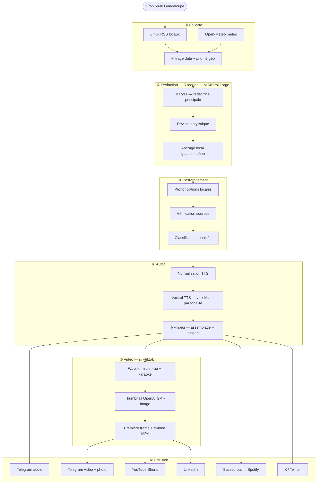

# Flash Info Karukera

> Bulletin audio quotidien de l'actualité guadeloupéenne, généré automatiquement et diffusé sur Telegram, Buzzsprout (Spotify), X/Twitter, YouTube, LinkedIn et Instagram.

---

## Sommaire

1. [Ce que fait le script](#ce-que-fait-le-script)
2. [Prérequis](#prérequis)
3. [Installation](#installation)
4. [Configuration — fichier `.env`](#configuration--fichier-env)
5. [Dossiers requis](#dossiers-requis)
6. [Utilisation — toutes les options](#utilisation--toutes-les-options)
7. [Automatisation GitHub Actions](#automatisation-github-actions)
8. [Configuration des comptes tiers](#configuration-des-comptes-tiers)
9. [Personnalisation du script](#personnalisation-du-script)
10. [Structure du projet](#structure-du-projet)
11. [Pipeline détaillé](#pipeline-détaillé)

---

## Ce que fait le script

**Flash Info Karukera** est un pipeline entièrement automatisé qui, chaque matin :

1. **Collecte** les dernières actualités guadeloupéennes depuis 6 flux RSS locaux et récupère la météo de Pointe-à-Pitre
2. **Rédige** un script radio en créole oral guadeloupéen via 3 passes LLM (Mistral Large)
3. **Synthétise** l'audio avec la voix Marie (Voxtral TTS), adaptée à la tonalité de chaque segment
4. **Génère** (optionnel) des vidéos courtes TikTok/Shorts avec waveform animée et sous-titres karaoké
5. **Crée** (optionnel) un thumbnail illustré via OpenAI GPT-Image
6. **Diffuse** sur Telegram, Buzzsprout → Spotify, X/Twitter, YouTube Shorts, LinkedIn et Instagram

```
Flux RSS + Météo
      │
      ▼
  Rédaction LLM (Mistral) ×3 passes
      │
      ▼
  Synthèse vocale TTS (Voxtral)
      │
      ├──► Audio MP3 ──► Telegram / Buzzsprout / X
      │
      └──► Vidéos MP4 ──► Telegram / YouTube / LinkedIn / Instagram
```

---

## Prérequis

### Logiciels à installer sur votre machine

| Logiciel | Version minimale | Installation |
|----------|-----------------|--------------|
| Python | 3.12 | [python.org](https://www.python.org/downloads/) |
| FFmpeg | 6.0+ | `apt install ffmpeg` (Linux) / `brew install ffmpeg` (Mac) |
| Git | toute version | [git-scm.com](https://git-scm.com/) |

Vérifier que tout est bien installé :
```bash
python --version      # doit afficher Python 3.12.x ou plus
ffmpeg -version       # doit afficher une version >= 6.0
```

### Comptes et clés API requis

Les comptes marqués **obligatoire** sont nécessaires pour le fonctionnement de base. Les autres sont optionnels selon les fonctionnalités souhaitées.

| Service | Utilité | Obligatoire |
|---------|---------|-------------|
| [Mistral AI](https://console.mistral.ai/) | Rédaction LLM + TTS Voxtral | ✅ Oui |
| [Telegram](https://telegram.org/) | Diffusion audio et vidéo | ✅ Oui |
| [Buzzsprout](https://www.buzzsprout.com/) | Hébergement podcast → Spotify | ✅ Oui |
| [X / Twitter](https://developer.x.com/) | Publication tweet | ✅ Oui |
| [OpenAI](https://platform.openai.com/) | Génération thumbnail (GPT-Image) | Non |
| [YouTube](https://console.cloud.google.com/) | Publication YouTube Shorts | Non |
| [LinkedIn](https://www.linkedin.com/developers/) | Publication vidéo LinkedIn | Non |
| [Meta for Developers](https://developers.facebook.com/) | Publication Reel Instagram | Non |

---

## Installation

### 1. Cloner le projet

```bash
git clone https://github.com/votre-compte/FlashInfoKarukera.git
cd FlashInfoKarukera
```

### 2. Créer un environnement virtuel Python (recommandé)

```bash
python -m venv .venv
source .venv/bin/activate        # Linux / Mac
.venv\Scripts\activate           # Windows
```

### 3. Installer les dépendances Python

```bash
pip install -r requirements.txt
```

### 4. Installer les polices emoji (Linux uniquement, requis pour les vidéos)

```bash
sudo apt install fonts-noto-color-emoji
```

### 5. Créer le fichier `.env`

Copier le modèle et remplir les valeurs (voir section suivante) :

```bash
cp .env.example .env   # si le fichier exemple existe
# ou créer directement :
nano .env
```

---

## Configuration — fichier `.env`

Créer un fichier `.env` à la racine du projet. **Ne jamais committer ce fichier** (il est listé dans `.gitignore`).

### Clés obligatoires

```env
# Mistral AI — rédaction et synthèse vocale
MISTRAL_API_KEY=sk-...

# Telegram — envoi des messages
TELEGRAM_BOT_TOKEN=123456:ABC-...
TELEGRAM_CHAT_ID=-1001234567890

# Buzzsprout — hébergement podcast
BUZZSPROUT_API_TOKEN=...
BUZZSPROUT_PODCAST_ID=...

# X / Twitter — publication tweet
X_API_KEY=...
X_API_SECRET=...
X_ACCESS_TOKEN=...
X_ACCESS_TOKEN_SECRET=...
```

### Clés optionnelles — Thumbnail (OpenAI)

Requis uniquement si vous souhaitez générer un thumbnail illustré automatiquement.

```env
OPENAI_API_KEY=sk-...
```

### Clés optionnelles — YouTube

Requis pour publier sur YouTube Shorts avec `--youtube`.

```env
YOUTUBE_CLIENT_ID=...
YOUTUBE_CLIENT_SECRET=...
YOUTUBE_REFRESH_TOKEN=          # rempli automatiquement après la première connexion
```

> **Première connexion YouTube :** lancez le script avec `--youtube` une première fois sur votre machine. Une fenêtre de navigateur s'ouvrira pour autoriser l'accès. Le `YOUTUBE_REFRESH_TOKEN` sera sauvegardé automatiquement dans `.env`.

### Clés optionnelles — LinkedIn

Requis pour publier sur LinkedIn avec `--linkedin`.

```env
LINKEDIN_CLIENT_ID=...
LINKEDIN_CLIENT_SECRET=...
LINKEDIN_ACCESS_TOKEN=          # token OAuth valide 60 jours
LINKEDIN_REFRESH_TOKEN=         # renouvelé automatiquement, valide 1 an
LINKEDIN_PERSON_ID=             # votre identifiant LinkedIn (visible dans l'URL de votre profil)
```

> **Trouver votre `LINKEDIN_PERSON_ID` :** connectez-vous à LinkedIn, allez sur votre profil, copiez la partie après `/in/` dans l'URL. Exemple : `https://www.linkedin.com/in/jean-dupont-abc123/` → `jean-dupont-abc123`.

> **Générer les tokens LinkedIn :** créez une app sur le [portail LinkedIn Developers](https://www.linkedin.com/developers/), activez les scopes `w_member_social` et `video.upload`, puis utilisez le flow OAuth 2.0 pour obtenir votre premier `access_token` et `refresh_token`. Le script les renouvelle ensuite automatiquement.

### Clés optionnelles — Instagram

Requis pour publier en Reel Instagram avec `--instagram`.

```env
INSTAGRAM_ACCESS_TOKEN=         # token long-lived valide 60 jours, renouvelé automatiquement
INSTAGRAM_USER_ID=              # ID numérique de votre compte Instagram Business
```

> **Prérequis Instagram :** votre compte Instagram doit être de type **Business** ou **Créateur** et être lié à une **Page Facebook**. Un compte personnel ne peut pas utiliser l'API de publication.

> **Trouver votre `INSTAGRAM_USER_ID` :** une fois votre app Meta configurée et votre token obtenu, appelez `https://graph.facebook.com/v21.0/me?fields=id&access_token=VOTRE_TOKEN`. La valeur `id` retournée est votre `INSTAGRAM_USER_ID`.

> **Renouvellement automatique :** contrairement à LinkedIn, Instagram n'utilise pas de refresh token séparé. Le script appelle `graph.instagram.com/refresh_access_token` avant chaque publication pour repousser l'expiration de 60 jours supplémentaires. Le nouveau token est sauvegardé dans `.env` automatiquement.

---

## Dossiers requis

### `Stingers/`

Contient les fichiers audio de jingle insérés entre chaque segment. Formats acceptés : `.mp3`, `.wav`.

```
Stingers/
└── mon_jingle.mp3
```

Si le dossier est vide, un stinger synthétique est généré automatiquement.

### `Media/`

Contient les images utilisées pour les thumbnails et les interstitiels vidéo.

```
Media/
├── botiran_profile.jpg               # image de référence pour GPT-Image (obligatoire si --tiktok)
├── botiran_news_default_thumbnail.png # thumbnail de secours si la génération OpenAI échoue
├── botiran_news_banner.png           # bannière utilisée dans les interstitiels
└── botiran_news_*.png                # autres visuels
```

### `prompts/`

Contient les prompts LLM utilisés par les trois passes de rédaction. Modifiables pour adapter le style éditorial.

```
prompts/
├── maryse.md     # rédactrice principale
├── styliste.md   # réviseur stylistique
├── ancrage.md    # ancrage géographique local
└── tones.md      # classification des tonalités
```

---

## Utilisation — toutes les options

### Syntaxe générale

```bash
python flash-info-gwada.py [OPTIONS]
```

### Options de base

| Option | Description | Exemple |
|--------|-------------|---------|
| *(aucune)* | Flash du jour, publication complète | `python flash-info-gwada.py` |
| `--date YYYY-MM-DD` | Rejouer un flash pour une date précise | `--date 2026-04-17` |
| `--dry-run` | Génère + envoie sur Telegram, sans Buzzsprout ni X | `--dry-run` |
| `--no-send` | Génère l'audio MP3 uniquement, sans aucun envoi | `--no-send` |
| `--output CHEMIN` | Chemin du fichier MP3 de sortie | `--output /tmp/test.mp3` |
| `--stinger FICHIER` | Choisir un stinger précis (doit être dans `Stingers/`) | `--stinger jingle.mp3` |
| `--verbose` | Logs détaillés : articles, JSONs, tonalités | `--verbose` |

### Options vidéo

| Option | Description | Exemple |
|--------|-------------|---------|
| `--tiktok` | Génère une vidéo MP4 (1080×1920) par segment avec waveform et sous-titres karaoké | `--tiktok` |
| `--youtube` | Publie les vidéos sur YouTube Shorts + la vidéo complète | `--tiktok --youtube` |
| `--linkedin` | Publie la vidéo complète sur LinkedIn avec l'intro et 5 hashtags aléatoires | `--tiktok --linkedin` |
| `--instagram` | Publie la vidéo complète en Reel Instagram avec l'intro et 5 hashtags aléatoires | `--tiktok --instagram` |

> `--youtube`, `--linkedin` et `--instagram` requièrent `--tiktok` pour générer les vidéos au préalable.

### Options thumbnail

| Option | Description | Exemple |
|--------|-------------|---------|
| `--thumbnail FICHIER` | Utiliser une image existante comme thumbnail à la place de la génération OpenAI | `--thumbnail Media/mon_image.png` |
| `--no-thumbnail` | Désactiver complètement le thumbnail (pas de génération, pas d'embed, pas d'envoi) | `--no-thumbnail` |
| `--generate-thumbnail` | Générer uniquement le thumbnail sans lancer toute la pipeline (pour tester) | `--generate-thumbnail` |

### Options de diagnostic

| Option | Description |
|--------|-------------|
| `--check-feeds` | Vérifie la disponibilité de chaque flux RSS et affiche un rapport. S'arrête sans générer d'audio. |
| `--transcript` | Transcrit l'audio généré via Voxtral STT pour vérifier la prononciation. Sauvegarde un `.txt` à côté du MP3. |
| `--test-interstitials RÉPERTOIRE` | Relit les vidéos d'un dossier généré précédemment, recrée les interstitiels et envoie sur Telegram. Évite de régénérer tout l'audio. |

### Exemples complets

```bash
# Flash du jour complet avec vidéo et publication partout
python flash-info-gwada.py --tiktok --youtube --linkedin --instagram

# Test sans aucune publication
python flash-info-gwada.py --dry-run --verbose

# Flash d'une date passée, vidéo TikTok uniquement, sans thumbnail
python flash-info-gwada.py --date 2026-04-15 --tiktok --no-thumbnail

# Utiliser un thumbnail personnalisé
python flash-info-gwada.py --tiktok --thumbnail Media/botiran_news_2304.png

# Rejouer les interstitiels d'une session précédente
python flash-info-gwada.py --test-interstitials /tmp/tiktok-20260423-1040

# Vérifier les flux RSS avant de lancer
python flash-info-gwada.py --check-feeds

# Générer et tester uniquement le thumbnail
python flash-info-gwada.py --generate-thumbnail --verbose
```

---

## Automatisation GitHub Actions

Le workflow `.github/workflows/flash-info.yml` lance le pipeline automatiquement.

### Déclenchement

- **Automatique** : tous les jours à **6h40 heure Guadeloupe** (10h40 UTC), avec `--tiktok` activé
- **Manuel** : depuis l'onglet **Actions** → **Flash Info Guadeloupe** → **Run workflow**

### Paramètres du déclenchement manuel

| Paramètre | Description | Valeur par défaut |
|-----------|-------------|-------------------|
| `date` | Date YYYY-MM-DD (vide = aujourd'hui) | *(vide)* |
| `dry_run` | Test sans publication Buzzsprout/X | `false` |
| `tiktok` | Générer les vidéos TikTok/Shorts | `true` |
| `youtube` | Publier sur YouTube | `false` |
| `linkedin` | Publier sur LinkedIn | `false` |
| `instagram` | Publier en Reel Instagram | `false` |
| `no_thumbnail` | Désactiver le thumbnail | `false` |
| `verbose` | Logs détaillés | `false` |

### Secrets GitHub à configurer

Dans **Settings → Secrets and variables → Actions → New repository secret**, ajouter :

**Obligatoires :**
```
MISTRAL_API_KEY
TELEGRAM_BOT_TOKEN
TELEGRAM_CHAT_ID
BUZZSPROUT_API_TOKEN
BUZZSPROUT_PODCAST_ID
X_API_KEY
X_API_SECRET
X_ACCESS_TOKEN
X_ACCESS_TOKEN_SECRET
```

**Optionnels — Thumbnail OpenAI :**
```
OPENAI_API_KEY
```

**Optionnels — YouTube :**
```
YOUTUBE_CLIENT_ID
YOUTUBE_CLIENT_SECRET
YOUTUBE_REFRESH_TOKEN
```

**Optionnels — LinkedIn :**
```
LINKEDIN_CLIENT_ID
LINKEDIN_CLIENT_SECRET
LINKEDIN_ACCESS_TOKEN
LINKEDIN_REFRESH_TOKEN
LINKEDIN_PERSON_ID
```

**Optionnels — Instagram :**
```
INSTAGRAM_ACCESS_TOKEN
INSTAGRAM_USER_ID
```

> **Important :** les tokens LinkedIn, Instagram et YouTube sont renouvelés automatiquement par le script en local. Pour GitHub Actions, mettre à jour les secrets manuellement si les tokens expirent (LinkedIn access token : 60 jours / refresh token : 1 an — Instagram : 60 jours renouvelés à chaque exécution).

---

## Configuration des comptes tiers

### Telegram

1. Créer un bot via [@BotFather](https://t.me/BotFather) (`/newbot`) → copier le token
2. Ajouter le bot à votre canal ou groupe
3. Récupérer le `chat_id` : envoyer un message et appeler `https://api.telegram.org/bot<TOKEN>/getUpdates`

### Buzzsprout

1. Aller dans **Account → API Access** sur buzzsprout.com
2. Copier le token et l'ID du podcast (visible dans l'URL de votre podcast)

### X / Twitter

1. Créer une app sur [developer.x.com](https://developer.x.com/) avec les permissions **Read and Write**
2. Dans **Keys and Tokens**, générer les 4 clés : API Key, API Secret, Access Token, Access Token Secret

### YouTube

1. Créer un projet sur [Google Cloud Console](https://console.cloud.google.com/)
2. Activer l'**YouTube Data API v3**
3. Créer des identifiants **OAuth 2.0** (type : application de bureau)
4. Télécharger le fichier JSON des identifiants
5. Copier `client_id` et `client_secret` dans `.env`
6. Lancer le script une première fois avec `--youtube` : une fenêtre de navigateur s'ouvre pour autoriser → le `YOUTUBE_REFRESH_TOKEN` est sauvegardé automatiquement

### LinkedIn

1. Créer une app sur [LinkedIn Developers](https://www.linkedin.com/developers/)
2. Dans **Products**, activer **Share on LinkedIn** et **Video Upload API**
3. Dans **Auth**, copier `Client ID` et `Client Secret`
4. Générer un access token via le flow OAuth 2.0 avec les scopes `w_member_social` et `video.upload`
5. Copier `access_token` et `refresh_token` dans `.env`
6. Le script renouvelle automatiquement les tokens à chaque exécution

### Instagram

1. Avoir un compte Instagram **Business** ou **Créateur** lié à une **Page Facebook** (obligatoire — l'API n'est pas disponible pour les comptes personnels)
2. Créer une app sur [Meta for Developers](https://developers.facebook.com/) → **Ajouter un produit → Instagram Graph API**
3. Dans **Permissions**, activer `instagram_content_publish` et `instagram_basic`
4. Générer un token utilisateur via le **Graph API Explorer**, puis l'échanger contre un token long-lived :
   ```
   GET https://graph.facebook.com/v21.0/oauth/access_token
     ?grant_type=fb_exchange_token
     &client_id={app-id}
     &client_secret={app-secret}
     &fb_exchange_token={short-lived-token}
   ```
5. Récupérer votre `INSTAGRAM_USER_ID` :
   ```
   GET https://graph.facebook.com/v21.0/me?fields=id&access_token={token}
   ```
6. Copier `access_token` et `id` dans `.env`
7. Le script renouvelle automatiquement le token avant chaque publication

---

## Personnalisation du script

### Ajouter un flux RSS

Dans `flash-info-gwada.py`, section `RSS_FEEDS` :

```python
RSS_FEEDS = [
    "https://www.franceantilles.fr/...",
    # Ajouter ici :
    "https://mon-media-local.fr/rss",
]
```

Ajouter le nom lisible dans `_SOURCE_NAMES` si besoin.

### Ajouter une prononciation locale

Dans `_PRONONCIATIONS_LOCALES` :

```python
_PRONONCIATIONS_LOCALES = {
    "SDIS": "Service Départemental d'Incendie et de Secours",
    # Ajouter ici :
    "MONSIGLE": "développement oral complet",
    "Cap-Excellence": "Cap Excèlans",
}
```

### Ajouter un sigle prononcé comme un mot (pas épelé)

Dans `_SIGLES_MOT` :

```python
_SIGLES_MOT = {"RCI", "BFMTV", "MON_SIGLE"}
```

### Modifier le style éditorial

Éditer les fichiers dans `prompts/` :

- `prompts/maryse.md` — prompt de la rédactrice principale (structure, ton, registre de langue)
- `prompts/styliste.md` — révision stylistique (supprimer le lyrisme, vérifier l'oralité)
- `prompts/ancrage.md` — ancrage géographique guadeloupéen (remplacer les génériques par des noms propres)
- `prompts/tones.md` — règles de classification des tonalités par segment

---

## Structure du projet

```
FlashInfoKarukera/
├── flash-info-gwada.py           # Script principal — pipeline complet
├── tts_normalize.py              # Normalisation texte pour le TTS
├── requirements.txt              # Dépendances Python
├── .env                          # Clés API (non versionné)
│
├── Stingers/                     # Jingles audio insérés entre les segments
│   └── *.mp3 / *.wav
│
├── Media/                        # Images pour thumbnails et interstitiels
│   ├── botiran_profile.jpg
│   ├── botiran_news_default_thumbnail.png
│   ├── botiran_news_banner.png
│   └── ...
│
├── prompts/                      # Prompts LLM des 3 passes de rédaction
│   ├── maryse.md
│   ├── styliste.md
│   ├── ancrage.md
│   └── tones.md
│
├── data/
│   └── rss.xml                   # Cache RSS local
│
└── .github/
    └── workflows/
        └── flash-info.yml        # GitHub Actions — cron + déclenchement manuel
```

---

## Pipeline détaillé



### Voix par tonalité

| Tonalité | Cas d'usage |
|----------|-------------|
| `neutral` | Info factuelle, météo, administratif |
| `happy` | Intro, outro, bonne nouvelle |
| `excited` | Sport, exploit, événement culturel |
| `sad` | Drame, accident, décès |
| `angry` | Grève, conflit, polémique |
| `curious` | Insolite, découverte, enquête |
