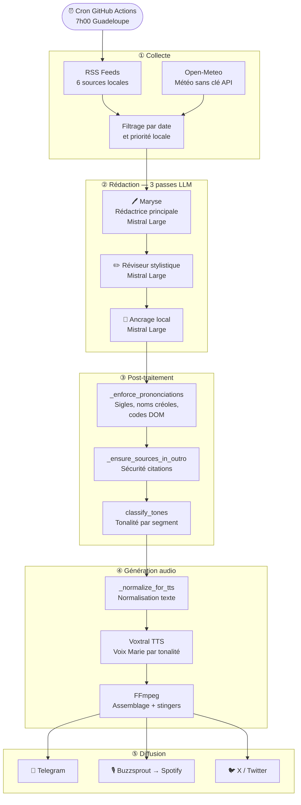
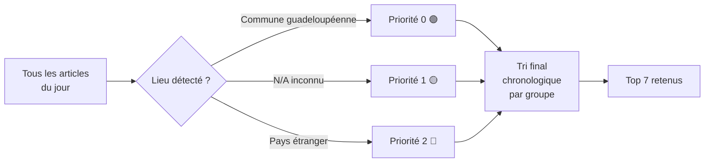
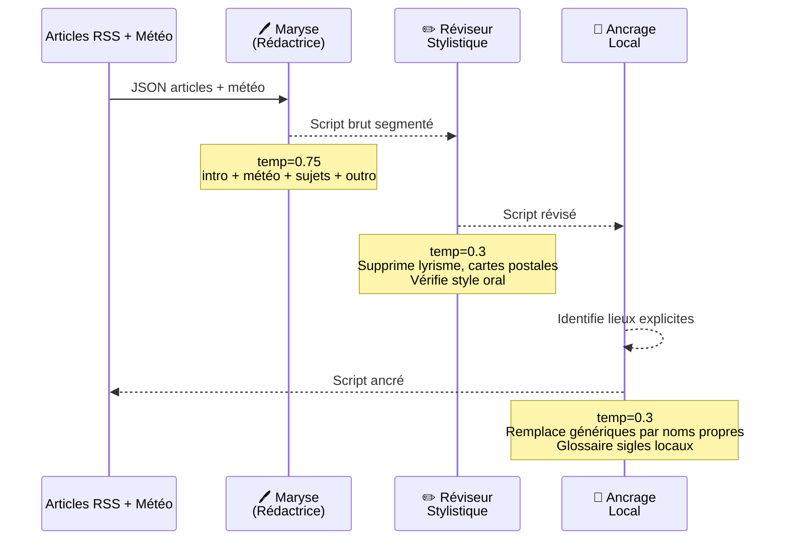
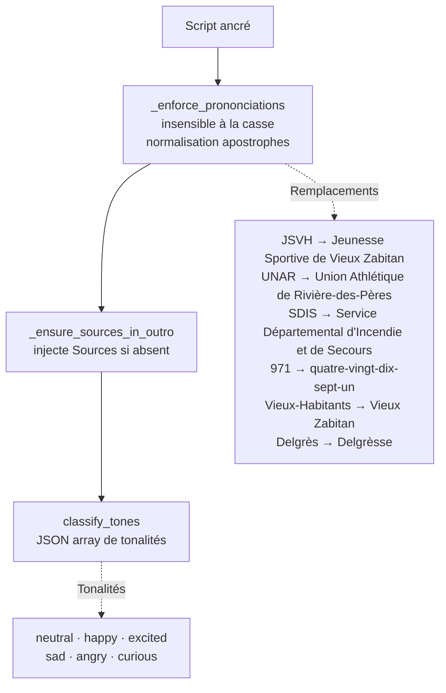
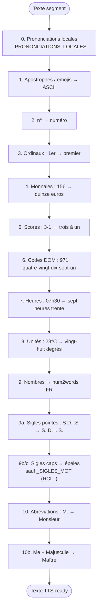
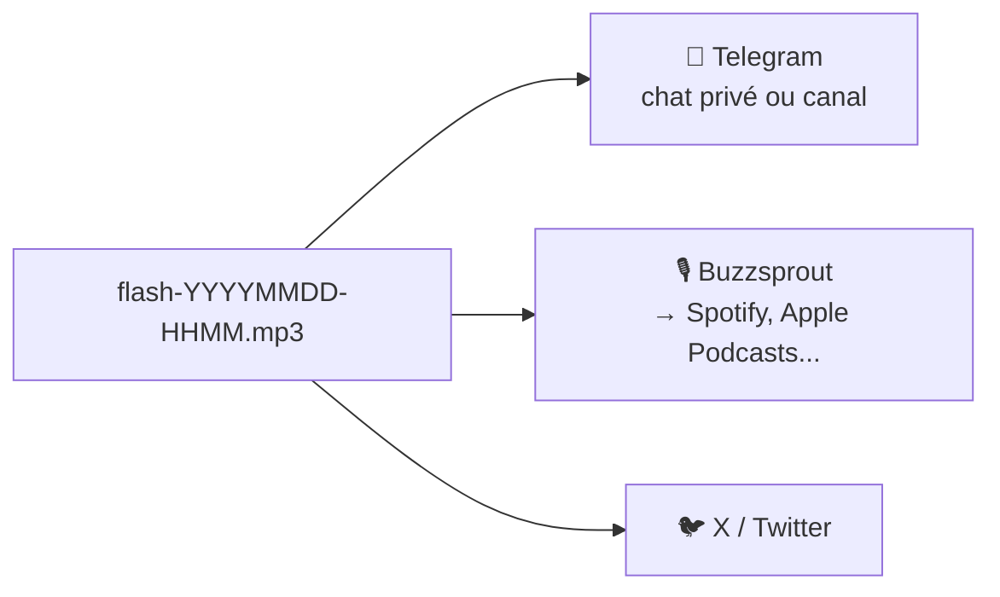

# Flash Info Karukera

> Bulletin audio quotidien de l'actualité guadeloupéenne, généré automatiquement et diffusé sur Telegram, Buzzsprout (Spotify) et X.

---

## Vue d'ensemble

**Flash Info Karukera** est un pipeline entièrement automatisé qui collecte les flux RSS locaux chaque matin, rédige un script radio en créole oral guadeloupéen, le synthétise en audio via Voxtral TTS, et le diffuse sur plusieurs canaux.

Le pipeline enchaîne six étapes principales :



---

## Architecture détaillée

### ① Collecte RSS et météo

Six flux RSS sont interrogés en parallèle et filtrés à la date cible :

| Source | URL |
|--------|-----|
| France-Antilles — Vie locale | `franceantilles.fr` |
| France-Antilles — Sports | `franceantilles.fr` |
| RCI Guadeloupe | `rci.fm` |
| Zyé a Mangrov'la | `zye-a-mangrovla.fr` |
| Région Guadeloupe | `regionguadeloupe.fr` |
| La 1ère — Économie | `la1ere.franceinfo.fr` |

Les articles sont **triés par priorité géographique** avant sélection des 7 meilleurs :



La météo est récupérée via [Open-Meteo](https://open-meteo.com/) (sans clé API) pour Pointe-à-Pitre.

---

### ② Rédaction — 3 passes LLM (Mistral Large)

Chaque passe a un rôle distinct et reçoit le script du précédent :



**Structure du script produit :**

```
INTRO      → "Bonjour, nous sommes le [DATE]... C'est parti."
MÉTÉO      → 2-3 phrases, conditions + températures + vent
SUJET 1    → 60-90 mots, transition géographique ou thématique
SUJET 2    → ...
...
SUJET N    → ...
OUTRO      → "Voilà pour ce Flash Info... Sources : X et Y."
```

Les segments sont séparés par `<<<SEG>>>`.

---

### ③ Post-traitement déterministe

Après les LLMs, trois passes de correction garantissent la qualité :



---

### ④ Normalisation TTS et génération audio

Avant chaque appel Voxtral, `_normalize_for_tts()` applique une chaîne de transformations dans un ordre strict :



**Voix par tonalité (voix Marie, Voxtral) :**

| Tonalité | Voice ID | Cas d'usage |
|----------|----------|-------------|
| `neutral` | `fr_marie_neutral` | Info factuelle, météo, administratif |
| `happy` | `fr_marie_happy` | Intro, outro, bonne nouvelle |
| `excited` | `fr_marie_excited` | Sport, exploit, événement culturel |
| `sad` | `fr_marie_sad` | Drame, accident, décès |
| `angry` | `fr_marie_angry` | Grève, conflit, polémique |
| `curious` | `fr_marie_curious` | Insolite, découverte, enquête |

---

### ⑤ Diffusion



---

## Installation

### Prérequis

- Python 3.12+
- FFmpeg (`apt install ffmpeg` ou `brew install ffmpeg`)
- Compte Mistral AI (Maryse + Voxtral TTS)
- Bot Telegram + chat ID
- Compte Buzzsprout
- App X/Twitter (tweepy)

### Dépendances Python

```bash
pip install -r requirements.txt
```

### Configuration `.env`

Créer un fichier `.env` à la racine du projet :

```env
MISTRAL_API_KEY=...
TELEGRAM_BOT_TOKEN=...
TELEGRAM_CHAT_ID=...
BUZZSPROUT_API_TOKEN=...
BUZZSPROUT_PODCAST_ID=...
X_API_KEY=...
X_API_SECRET=...
X_ACCESS_TOKEN=...
X_ACCESS_TOKEN_SECRET=...
```

### Stingers

Déposer les fichiers audio de jingle dans le dossier `Stingers/` (`.mp3` ou `.wav`).
Si le dossier est vide, un stinger synthétique est généré automatiquement.

---

## Utilisation

```bash
# Flash du jour (publication complète)
python flash-info-gwada.py

# Flash d'une date passée
python flash-info-gwada.py --date 2026-04-17

# Test : génère + Telegram, sans Buzzsprout ni X
python flash-info-gwada.py --dry-run

# Génère l'audio seulement, sans aucun envoi
python flash-info-gwada.py --no-send

# Logs détaillés (textes, JSONs, tonalités)
python flash-info-gwada.py --dry-run --verbose

# Choisir un stinger précis
python flash-info-gwada.py --stinger mon_jingle.mp3

# Chemin de sortie personnalisé
python flash-info-gwada.py --no-send --output /tmp/test.mp3
```

---

## Automatisation GitHub Actions

Le workflow `.github/workflows/flash-info.yml` déclenche le pipeline :

- **Automatiquement** tous les jours à 7h00 heure Guadeloupe (11h00 UTC)
- **Manuellement** depuis l'onglet Actions avec les options :
  - `date` — rejouer un flash passé
  - `dry_run` — test sans publication Buzzsprout/X
  - `verbose` — logs détaillés dans les Actions

Les secrets API sont configurés dans **Settings → Secrets and variables → Actions** :
`MISTRAL_API_KEY`, `TELEGRAM_BOT_TOKEN`, `TELEGRAM_CHAT_ID`, `BUZZSPROUT_API_TOKEN`, `BUZZSPROUT_PODCAST_ID`, `X_API_KEY`, `X_API_SECRET`, `X_ACCESS_TOKEN`, `X_ACCESS_TOKEN_SECRET`.

---

## Personnalisation

### Ajouter un flux RSS

```python
RSS_FEEDS = [
    ...
    "https://mon-media-local.fr/rss",
]
```

Ajouter la correspondance nom dans `_SOURCE_NAMES` si besoin.

### Ajouter une prononciation locale

```python
_PRONONCIATIONS_LOCALES = {
    ...
    "Mon Sigle": "développement oral complet",
    "Nom-Composé": "Prononziation Kréyòl",
}
```

### Ajouter un sigle prononcé comme un mot

```python
_SIGLES_MOT = {"RCI", "MON_SIGLE", ...}
```

---

## Structure du projet

```
FlashInfoKarukera/
├── flash-info-gwada.py       # Script principal
├── requirements.txt          # num2words, tweepy
├── .env                      # Clés API (non versionné)
├── Stingers/                 # Fichiers audio jingle
│   └── *.mp3 / *.wav
└── .github/
    └── workflows/
        └── flash-info.yml    # GitHub Actions
```
