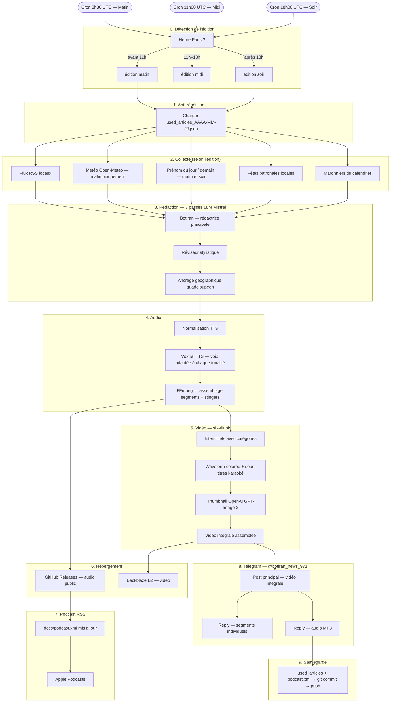

# Flash Info Karukera

> Bulletin audio quotidien de l'actualité guadeloupéenne + horoscope créole, lu par Botiran, généré automatiquement cinq fois par jour et diffusé sur Telegram et Apple Podcasts.

**Site web :** https://famibelle.github.io/FlashInfoKarukera/
**Canal Telegram :** https://t.me/botiran_news_971
**Podcast RSS :** https://famibelle.github.io/FlashInfoKarukera/podcast.xml

---

## Sommaire

1. [À quoi ça sert ?](#à-quoi-ça-sert-)
2. [Comment ça fonctionne en un coup d'œil ?](#comment-ça-fonctionne-en-un-coup-dœil-)
3. [Les cinq éditions quotidiennes](#les-cinq-éditions-quotidiennes)
4. [La voix de Botiran](#la-voix-de-botiran)
5. [Ce qu'il faut installer sur votre ordinateur](#ce-quil-faut-installer-sur-votre-ordinateur)
6. [Les comptes à créer en ligne](#les-comptes-à-créer-en-ligne)
7. [Installation pas à pas](#installation-pas-à-pas)
8. [Configuration — le fichier de clés API (.env)](#configuration--le-fichier-de-clés-api-env)
9. [Les dossiers nécessaires](#les-dossiers-nécessaires)
10. [Lancer le script à la main — toutes les options](#lancer-le-script-à-la-main--toutes-les-options)
11. [Automatisation — GitHub Actions (le pilote automatique)](#automatisation--github-actions-le-pilote-automatique)
12. [Ce qui se passe chaque jour automatiquement](#ce-qui-se-passe-chaque-jour-automatiquement)
13. [Configurer les comptes tiers étape par étape](#configurer-les-comptes-tiers-étape-par-étape)
14. [Personnaliser le flash info](#personnaliser-le-flash-info)
15. [Structure complète du projet](#structure-complète-du-projet)
16. [Pipeline technique détaillé](#pipeline-technique-détaillé)
17. [Questions fréquentes](#questions-fréquentes)

---

## À quoi ça sert ?

**Flash Info Karukera** est un programme informatique qui crée automatiquement un bulletin d'informations audio sur l'actualité de la Guadeloupe — comme une émission de radio, mais fabriquée par un ordinateur.

Chaque jour, **cinq fois par jour** (3 flash infos + 2 horoscopes), le programme :

1. Va chercher les dernières nouvelles guadeloupéennes sur les sites d'information locaux
2. Écrit un texte radio dans la voix guadeloupéenne de **Botiran** (inspirée de Maryse Condé)
3. Transforme ce texte en voix humaine (synthèse vocale)
4. Crée une vidéo avec les paroles qui défilent (style karaoké)
5. Publie automatiquement sur le **canal Telegram @botiran_news_971** et sur **Apple Podcasts**

**Karukera**, c'est le nom amérindien de la Guadeloupe — "l'île aux belles eaux".

---

## Comment ça fonctionne en un coup d'œil ?

```
Cinq fois par jour (3 flash infos + 2 horoscopes) :

  Sites d'info locaux (RSS)          Météo de Pointe-à-Pitre
         │                                     │
         └──────────────┬──────────────────────┘
                        │
                   Botiran rédige
                   (intelligence artificielle Mistral)
                        │
                   Révision du style
                        │
                   Ancrage guadeloupéen
                        │
                   Lecture à voix haute
                   (synthèse vocale Voxtral)
                        │
              ┌─────────┴──────────┐
              │                    │
           Audio MP3           Vidéo MP4
              │                    │
    ┌─────────┴──────┐    ┌────────┴──────────┐
    │                │    │                   │
 Telegram        GitHub  Telegram          Apple
 (reply audio)  Releases (post principal)  Podcasts
```

---

## Les cinq éditions quotidiennes

Le programme publie **trois flash infos** et **deux horoscopes** par jour :

| Édition | Heure (Paris, été) | Heure (Guadeloupe) | Contenu |
|---------|-------------------|---------------------|---------|
| **Flash info matin** | 5h30 | 1h30 | Intro du matin · Actualités (24h) · Météo · Prénom du jour |
| **Horoscope matin** | 6h00 | 2h00 | Formule d'éveil · signes · intention du jour · vidéo TikTok |
| **Flash info midi** | 13h00 | 9h00 | Intro du midi · Actualités (8h) |
| **Horoscope soir** | 19h00 | 15h00 | Formule de clôture · signes · bilan du jour · bonne nuit |
| **Flash info soir** | 20h00 | 16h00 | Intro du soir · Actualités (8h) · Prénom de demain |

> La Guadeloupe a **4 heures de retard** sur Paris en hiver, **5 heures** en été (la Guadeloupe ne change pas d'heure).

### Ce qui change entre les éditions

- **L'intro et l'outro** sont différentes pour chaque moment de la journée
- **La météo** n'est lue que le matin
- **Les prénoms** : le matin on souhaite la fête aux prénoms du jour, le soir on annonce les prénoms de *demain*
- **Les maronniers** (événements récurrents du calendrier guadeloupéen) peuvent apparaître selon le jour

### Telegram — structure des posts

Pour chaque flash info ou horoscope :

1. **Post principal** : la vidéo intégrale (avec thumbnail illustrée)
2. **Replies** : les segments individuels (un par sujet, en réponse au post principal)
3. **Reply audio** : le fichier MP3 complet (en réponse au post principal)

### Anti-répétition entre les éditions

Pour éviter de répéter les mêmes nouvelles trois fois dans la même journée, le programme garde en mémoire les articles déjà utilisés dans un fichier :

```
data/used_articles_AAAA-MM-JJ.json
```

Ce fichier est mis à jour automatiquement après chaque édition. Chaque édition choisit des articles *différents* des éditions précédentes de la même journée.

---

## La voix de Botiran

**Botiran** est la voix IA de ce flash info — inspirée de **Maryse Condé** (1934–2024), romancière guadeloupéenne, lauréate du prix Nobel alternatif de littérature en 2018. Elle a écrit *Ségou*, *Moi, Tituba, sorcière...*, *La Migration des cœurs*.

La voix est directe, chaleureuse, ancrée dans le quotidien guadeloupéen, sans langue de bois. Elle parle de Karukera pour les Guadeloupéens et la diaspora.

Sa personnalité est définie dans le fichier `prompts/maryse_ame.md`.

---

## Ce qu'il faut installer sur votre ordinateur

### Python (le moteur du programme)

Version **3.12 ou plus récente**.

**Sur Windows :**
1. Aller sur [python.org/downloads](https://www.python.org/downloads/)
2. Cliquer sur le gros bouton "Download Python 3.12.x"
3. **Important :** cocher la case "Add Python to PATH" avant d'installer
4. Vérifier : `python --version` dans l'invite de commandes

**Sur Mac :** `brew install python@3.12`

**Sur Linux :** `sudo apt install python3.12 python3.12-venv python3-pip`

### FFmpeg (pour créer les vidéos et assembler l'audio)

**Sur Windows :**
1. Aller sur [ffmpeg.org/download.html](https://ffmpeg.org/download.html)
2. Télécharger la version "essentials" pour Windows
3. Extraire dans `C:\ffmpeg\` et ajouter `C:\ffmpeg\bin` au PATH
4. Vérifier : `ffmpeg -version`

**Sur Mac :** `brew install ffmpeg`

**Sur Linux :** `sudo apt install ffmpeg fonts-noto-color-emoji`

### Git

**Sur Windows :** [git-scm.com](https://git-scm.com/)
**Sur Mac :** `brew install git`
**Sur Linux :** `sudo apt install git`

---

## Les comptes à créer en ligne

### Services obligatoires

| Service | À quoi ça sert | Coût |
|---------|----------------|------|
| [Mistral AI](https://console.mistral.ai/) | Rédige le texte radio + synthèse vocale | Payant selon utilisation |
| [Telegram](https://telegram.org/) | Canal de diffusion des audios et vidéos | Gratuit |
| [GitHub](https://github.com/) | Hébergement du code + audio public (GitHub Releases) | Gratuit |

### Services optionnels

| Service | À quoi ça sert | Coût |
|---------|----------------|------|
| [OpenAI](https://platform.openai.com/) | Génère le thumbnail illustré (GPT-Image-2) | Payant selon utilisation |
| [Buzzsprout](https://www.buzzsprout.com/) | Hébergement podcast supplémentaire | Gratuit avec limites |
| [Backblaze B2](https://www.backblaze.com/b2/) | Stockage cloud des fichiers audio/vidéo | Gratuit jusqu'à 10 Go |

---

## Installation pas à pas

### Étape 1 — Télécharger le projet

```bash
git clone https://github.com/famibelle/FlashInfoKarukera.git
cd FlashInfoKarukera
```

### Étape 2 — Créer un environnement Python isolé

```bash
python -m venv .venv

# Sur Windows :
.venv\Scripts\activate

# Sur Mac ou Linux :
source .venv/bin/activate
```

### Étape 3 — Installer les bibliothèques

```bash
pip install -r requirements.txt
```

### Étape 4 — Créer le fichier de configuration `.env`

```bash
# Sur Mac ou Linux :
touch .env

# Sur Windows :
copy NUL .env
```

### Étape 5 — Créer les dossiers nécessaires

```bash
mkdir Stingers
mkdir Media
```

---

## Configuration — le fichier de clés API (.env)

Le fichier `.env` contient toutes vos clés d'accès. **Ce fichier est privé** — il ne doit jamais être partagé ni envoyé sur GitHub (le `.gitignore` l'exclut automatiquement).

### Clés obligatoires

```env
# ─────────────────────────────────────────────────
# Mistral AI — cerveau du flash info
# https://console.mistral.ai/
# ─────────────────────────────────────────────────
MISTRAL_API_KEY=votre-clé-mistral-ici

# ─────────────────────────────────────────────────
# Telegram — canal de diffusion
# Voir section "Configurer les comptes tiers" ci-dessous
# TELEGRAM_CHAT_ID : ID numérique du canal (commence par -100)
# Pour le trouver : curl "https://api.telegram.org/bot<TOKEN>/getChat?chat_id=@votre_canal"
# ─────────────────────────────────────────────────
TELEGRAM_BOT_TOKEN=123456789:ABCdef-votre-token-ici
TELEGRAM_CHAT_ID=-100XXXXXXXXXX

# ─────────────────────────────────────────────────
# GitHub — hébergement audio public (GitHub Releases)
# GITHUB_TOKEN : Personal Access Token avec permissions "contents: write"
# GITHUB_REPO  : format "proprietaire/depot" (ex: famibelle/FlashInfoKarukera)
# ─────────────────────────────────────────────────
GITHUB_TOKEN=ghp_votre-token-github
GITHUB_REPO=votre-compte/FlashInfoKarukera
```

### Clés optionnelles — Thumbnail OpenAI

```env
# OpenAI GPT-Image-2 — génération du thumbnail illustré
# https://platform.openai.com/
OPENAI_API_KEY=sk-votre-clé-openai
```

### Clés optionnelles — Buzzsprout (podcast)

```env
# Buzzsprout — hébergement podcast supplémentaire
# buzzsprout.com → Account → API Access
BUZZSPROUT_API_TOKEN=votre-token-buzzsprout
BUZZSPROUT_PODCAST_ID=votre-id-podcast
```

### Clés optionnelles — Stockage Backblaze B2

```env
# Backblaze B2 — stockage cloud des fichiers
# https://www.backblaze.com/b2/
B2_KEY_ID=votre-key-id
B2_APPLICATION_KEY=votre-application-key
B2_BUCKET_NAME=votre-bucket
B2_ENDPOINT=https://s3.us-west-004.backblazeb2.com
```

### Clés optionnelles — Publication vidéo

```env
# YouTube Shorts
YOUTUBE_CLIENT_ID=votre-client-id.apps.googleusercontent.com
YOUTUBE_CLIENT_SECRET=votre-client-secret
YOUTUBE_REFRESH_TOKEN=

# LinkedIn
LINKEDIN_CLIENT_ID=votre-client-id
LINKEDIN_CLIENT_SECRET=votre-client-secret
LINKEDIN_ACCESS_TOKEN=votre-access-token
LINKEDIN_REFRESH_TOKEN=votre-refresh-token
LINKEDIN_PERSON_ID=votre-identifiant-linkedin

# Instagram (compte Business ou Créateur requis)
INSTAGRAM_ACCESS_TOKEN=votre-token
INSTAGRAM_USER_ID=123456789

# X / Twitter
X_API_KEY=votre-api-key
X_API_SECRET=votre-api-secret
X_ACCESS_TOKEN=votre-access-token
X_ACCESS_TOKEN_SECRET=votre-access-token-secret
```

---

## Les dossiers nécessaires

### `Stingers/` — Les jingles musicaux

Petites musiques insérées entre chaque segment. Formats : `.mp3` ou `.wav`.
Si le dossier est vide, un bip simple est généré automatiquement.

### `Media/` — Les images

```
Media/
├── botiran_profile.jpg                    # portrait de référence pour GPT-Image (obligatoire si --tiktok)
├── botiran_news_default_thumbnail.png     # image de secours si la génération automatique échoue
└── botiran_news_banner.png                # bannière affichée dans les interstitiels vidéo
```

### `prompts/` — Les instructions pour l'IA

```
prompts/
├── maryse_ame.md    # L'âme de Botiran — qui elle est, son histoire, sa voix
├── maryse.md        # Comment Botiran rédige le flash info
├── styliste.md      # Révision du style oral
├── ancrage.md       # Ancrage géographique guadeloupéen
├── tones.md         # Classification des tonalités
├── prenom.md        # Comment souhaiter la fête aux prénoms du jour
└── horoscope.md     # Comment lire l'horoscope
```

### `data/` — Les données et la mémoire

```
data/
├── sources.py                    # Flux RSS locaux et noms des sources
├── tts_normalize.py              # Prononciations locales (ex. : "Lyannaj" → "Lyan naje")
├── fetes_patronales.py           # Fêtes patronales des communes guadeloupéennes
├── marroniers.py                 # Événements récurrents du calendrier
├── geography.py                  # Lieux et géographie de la Guadeloupe
├── weather_codes.py              # Codes météo → texte lisible
├── rss.xml                       # Cache des actualités (mis à jour automatiquement)
├── used_articles_AAAA-MM-JJ.json # Anti-répétition articles du jour (créé automatiquement)
└── used_flora.json               # Anti-répétition flore/faune horoscope — fenêtre 7 jours
```

### `docs/` — Site web GitHub Pages

```
docs/
├── index.html      # Page d'accueil publique (liens Apple Podcasts, Telegram, RSS)
├── favicon.svg     # Favicon lambi 🐚
├── artwork.jpg     # Pochette du podcast
└── podcast.xml     # Flux RSS unifié (flash info + horoscope)
```

---

## Lancer le script à la main — toutes les options

### Flash info

```bash
python flash-info-gwada.py [OPTIONS]
```

| Option | Ce que ça fait | Exemple |
|--------|----------------|---------|
| *(aucune)* | Lance le flash complet et publie partout | `python flash-info-gwada.py` |
| `--edition` | matin / midi / soir (auto si absent) | `--edition soir` |
| `--date AAAA-MM-JJ` | Rejouer un flash pour une date passée | `--date 2026-04-17` |
| `--dry-run` | Génère l'audio et l'envoie sur Telegram, sans publier ailleurs | `--dry-run` |
| `--no-send` | Génère le MP3 sans l'envoyer nulle part | `--no-send` |
| `--tiktok` | Génère les vidéos verticales (1080×1920) | `--tiktok` |
| `--telegram` | Force l'envoi Telegram (inclus avec --tiktok) | `--telegram` |
| `--no-thumbnail` | Désactive la génération du thumbnail | `--no-thumbnail` |
| `--horoscope-signs N` | Nombre de signes dans la rubrique horoscope (défaut : 3) | `--horoscope-signs 3` |
| `--horoscope-include SIGNE` | Forcer un signe précis | `--horoscope-include verseau` |
| `--verbose` | Affiche les détails d'exécution | `--verbose` |

### Horoscope

```bash
python horoscope-gwada.py [OPTIONS]
```

| Option | Ce que ça fait | Exemple |
|--------|----------------|---------|
| `--edition` | matin (intention, éveil) ou soir (bilan, nuit) | `--edition soir` |
| `--horoscope-signs N` | Nombre de signes (défaut : 7) | `--horoscope-signs 3` |
| `--horoscope-include SIGNE` | Forcer un signe précis | `--horoscope-include libra` |
| `--tiktok` | Génère la vidéo et l'envoie sur Telegram | `--tiktok` |
| `--telegram` | Envoie l'audio MP3 sur Telegram | `--telegram` |
| `--no-send` | Génère sans publier sur Buzzsprout | `--no-send` |
| `--date AAAA-MM-JJ` | Générer l'horoscope pour une date précise | `--date 2026-04-27` |
| `--verbose` | Affiche le texte généré pour chaque signe | `--verbose` |

### Options de diagnostic

| Option | Ce que ça fait |
|--------|----------------|
| `--check-feeds` | Vérifie que tous les sites d'info sont accessibles |
| `--transcript` | Transcrit l'audio généré pour vérifier la prononciation |
| `--test-prenom [DATE]` | Affiche le prénom du jour sans lancer le flash |

### Exemples concrets

```bash
# Flash du soir complet avec vidéo
python flash-info-gwada.py --edition soir --tiktok --telegram --verbose

# Test rapide sans rien publier
python flash-info-gwada.py --dry-run --verbose

# Horoscope soir avec 3 signes
python horoscope-gwada.py --edition soir --horoscope-signs 3 --tiktok --telegram

# Vérifier le prénom du 15 août
python flash-info-gwada.py --test-prenom 2026-08-15

# Vérifier que les sites d'info sont accessibles
python flash-info-gwada.py --check-feeds
```

---

## Automatisation — GitHub Actions (le pilote automatique)

GitHub Actions lance automatiquement le programme cinq fois par jour, sans intervention manuelle.

### Les secrets à configurer sur GitHub

Aller sur la page du projet → **Settings** → **Secrets and variables** → **Actions** → **New repository secret**.

**Obligatoires :**
```
MISTRAL_API_KEY
TELEGRAM_BOT_TOKEN
TELEGRAM_CHAT_ID          ← ID numérique du canal (commence par -100)
GITHUB_TOKEN              ← généré automatiquement par GitHub Actions (pas à configurer)
PAT_SUBMODULE             ← Personal Access Token pour les submodules privés
```

**Optionnels :**
```
OPENAI_API_KEY
BUZZSPROUT_API_TOKEN
BUZZSPROUT_PODCAST_ID
B2_KEY_ID
B2_APPLICATION_KEY
B2_BUCKET_NAME
B2_ENDPOINT
YOUTUBE_CLIENT_ID / YOUTUBE_CLIENT_SECRET / YOUTUBE_REFRESH_TOKEN
LINKEDIN_CLIENT_ID / LINKEDIN_CLIENT_SECRET / LINKEDIN_ACCESS_TOKEN / LINKEDIN_REFRESH_TOKEN / LINKEDIN_PERSON_ID
INSTAGRAM_ACCESS_TOKEN / INSTAGRAM_USER_ID
X_API_KEY / X_API_SECRET / X_ACCESS_TOKEN / X_ACCESS_TOKEN_SECRET
```

### Horaires (heure de Paris, heure d'été — UTC+2)

| Workflow | Heure Paris | Heure UTC | Édition |
|----------|-------------|-----------|---------|
| Flash info matin | 5h30 | 3h30 | matin |
| Horoscope matin | 6h00 | 4h00 | matin |
| Flash info midi | 13h00 | 11h00 | midi |
| Horoscope soir | 19h00 | 17h00 | soir |
| Flash info soir | 20h00 | 18h00 | soir |

> En heure d'hiver (UTC+1), ajouter 1h à l'heure Paris.

### Lancer manuellement depuis GitHub

1. Aller sur la page du projet → onglet **Actions**
2. Choisir **Flash Info Guadeloupe** ou **Horoscope Quotidien**
3. Cliquer sur **Run workflow** → remplir les options → **Run workflow**

---

## Ce qui se passe chaque jour automatiquement

### 5h30 (Paris) — Flash info matin

1. Récupération des **actualités de la nuit** (RSS locaux)
2. Récupération de la **météo** de Pointe-à-Pitre
3. Récupération du **prénom du jour**
4. Botiran **rédige** le flash (3 passes : rédaction → révision → ancrage local)
5. **Synthèse vocale** du texte
6. **Génération de la vidéo** avec thumbnail illustrée (GPT-Image-2)
7. Upload audio sur **GitHub Releases** (URL publique pour le podcast RSS)
8. **Telegram** : vidéo intégrale en post principal → segments en reply → audio MP3 en reply
9. Mise à jour du **podcast RSS** (`docs/podcast.xml`)
10. Sauvegarde de l'**anti-répétition** dans `data/used_articles_AAAA-MM-JJ.json`

### 6h00 (Paris) — Horoscope matin

1. Récupération de l'horoscope (API)
2. Botiran rédige **l'intro** (formule d'éveil), **chaque signe** (5 rubriques), **l'outro** (bénédiction du lever)
3. Synthèse vocale + génération vidéo
4. Upload audio sur **GitHub Releases**
5. **Telegram** : vidéo en post principal → audio en reply
6. Mise à jour du **podcast RSS**
7. Sauvegarde de l'**anti-répétition flore/faune**

### 13h00 (Paris) — Flash info midi

Même processus que le matin, sans météo ni prénoms. Les articles du matin sont exclus automatiquement.

### 19h00 (Paris) — Horoscope soir

Même processus que l'horoscope matin, mais avec formules de bilan et de bonne nuit.

### 20h00 (Paris) — Flash info soir

Même processus que le matin, avec **prénoms de demain**. Les articles du matin et du midi sont exclus.

---

## Hébergement audio — GitHub Releases

Les fichiers audio sont hébergés sur **GitHub Releases** (gratuit, public, pas de limite de bande passante raisonnable).

- Un Release par mois, par type : `flash-info-AAAA-MM` et `horoscope-AAAA-MM`
- Les URL sont permanentes et publiques — parfaites pour les enclosures RSS
- Le RSS unifié `docs/podcast.xml` pointe vers ces URLs

---

## Podcast RSS unifié

Le fichier `docs/podcast.xml` contient **à la fois les flash infos et les horoscopes** dans un seul flux RSS.

- Accessible sur Apple Podcasts via l'URL : `https://famibelle.github.io/FlashInfoKarukera/podcast.xml`
- Mis à jour automatiquement après chaque génération
- Commité dans le dépôt par GitHub Actions

---

## Configurer les comptes tiers étape par étape

### Telegram — Créer un bot et un canal

**Créer le bot :**
1. Ouvrir Telegram → chercher **@BotFather**
2. Envoyer `/newbot`
3. Donner un nom, puis un nom d'utilisateur (doit finir par `bot`)
4. BotFather envoie le token → c'est votre `TELEGRAM_BOT_TOKEN`

**Créer le canal :**
1. Créer un canal public sur Telegram
2. Ajouter le bot comme **administrateur** avec les droits de publication

**Trouver le TELEGRAM_CHAT_ID :**
```bash
curl "https://api.telegram.org/bot<VOTRE_TOKEN>/getChat?chat_id=@votre_canal"
```
La valeur `"id"` dans la réponse est votre `TELEGRAM_CHAT_ID` (commence par `-100`).

### GitHub — Personal Access Token

Pour l'upload des fichiers audio sur GitHub Releases :
1. GitHub → **Settings** → **Developer settings** → **Personal access tokens** → **Tokens (classic)**
2. **Generate new token** → cocher `repo` (accès complet au dépôt)
3. Copier le token → c'est votre `GITHUB_TOKEN` local (dans `.env`)

> Sur GitHub Actions, le `GITHUB_TOKEN` est fourni automatiquement — pas besoin de le configurer en secret.

### Buzzsprout (optionnel)

1. Se connecter sur [buzzsprout.com](https://www.buzzsprout.com/)
2. **Account** → **API Access** → copier l'API Token
3. Votre Podcast ID est dans l'URL : `buzzsprout.com/123456/` → `123456`

### YouTube (optionnel)

1. [console.cloud.google.com](https://console.cloud.google.com/) → nouveau projet
2. Activer **YouTube Data API v3**
3. **Credentials** → **OAuth client ID** → **Desktop application**
4. Télécharger le JSON, copier `client_id` et `client_secret` dans `.env`
5. Premier lancement : `python flash-info-gwada.py --tiktok --youtube` → une fenêtre s'ouvre pour autoriser l'accès

### LinkedIn (optionnel)

1. [linkedin.com/developers](https://www.linkedin.com/developers/) → **Create app**
2. Activer **Share on LinkedIn** et **Video Upload API**
3. Copier `Client ID` et `Client Secret` dans `.env`
4. Générer les tokens OAuth avec les scopes `w_member_social` et `video.upload`

> Les tokens LinkedIn expirent après 60 jours — à renouveler manuellement dans les secrets GitHub.

### Instagram (optionnel)

> Nécessite un compte **Business** ou **Créateur** lié à une Page Facebook.

1. [developers.facebook.com](https://developers.facebook.com/) → nouvelle app Business
2. Ajouter **Instagram Graph API**
3. Activer `instagram_content_publish` et `instagram_basic`
4. Générer un token long (60 jours) et récupérer votre `INSTAGRAM_USER_ID`

---

## Personnaliser le flash info

### Ajouter un site d'information

Ouvrir `data/sources.py` → ajouter l'URL du flux RSS dans `RSS_FEEDS` et le nom dans `RSS_SOURCES`.

### Corriger une prononciation

Ouvrir `data/tts_normalize.py` → ajouter dans `PRONONCIATIONS_LOCALES` :

```python
"Lyannaj": "Lyan naje",
"Cap-Excellence": "Cap Excèlans",
```

### Ajouter une fête patronale

Ouvrir `data/fetes_patronales.py` → ajouter dans `COMMUNES_FETES_PATRONALES` :

```python
"09-15": ["Nouvelle-Commune"],
```

### Modifier la voix de Botiran

- **Son identité** → `prompts/maryse_ame.md`
- **La structure du flash** → `prompts/maryse.md`
- **Le style oral** → `prompts/styliste.md`
- **L'ancrage guadeloupéen** → `prompts/ancrage.md`
- **Les prénoms** → `prompts/prenom.md`
- **L'horoscope** → `prompts/horoscope.md`

> Ne supprimez pas les mots entre `{accolades}` — ce sont des variables remplies automatiquement.

---

## Structure complète du projet

```
FlashInfoKarukera/
│
├── flash-info-gwada.py           # ★ Script flash info (3 éditions/jour)
├── horoscope-gwada.py            # ★ Script horoscope (2 éditions/jour)
├── requirements.txt              # Dépendances Python
├── .env                          # Clés API (privé, exclu de Git)
├── .gitignore
│
├── Stingers/                     # Jingles audio entre les segments
├── Media/                        # Images pour thumbnails et interstitiels
│
├── prompts/                      # Instructions pour l'IA (modifiables)
│   ├── maryse_ame.md
│   ├── maryse.md
│   ├── styliste.md
│   ├── ancrage.md
│   ├── tones.md
│   ├── prenom.md
│   └── horoscope.md
│
├── data/
│   ├── sources.py
│   ├── tts_normalize.py
│   ├── fetes_patronales.py
│   ├── marroniers.py
│   ├── geography.py
│   ├── weather_codes.py
│   ├── rss.xml                        # Cache actualités
│   ├── used_articles_AAAA-MM-JJ.json  # Anti-répétition articles
│   └── used_flora.json                # Anti-répétition flore/faune horoscope
│
├── docs/                              # Site GitHub Pages
│   ├── index.html                     # Page d'accueil publique
│   ├── favicon.svg                    # Favicon lambi 🐚
│   ├── artwork.jpg                    # Pochette podcast
│   └── podcast.xml                    # Flux RSS unifié (flash info + horoscope)
│
└── .github/
    └── workflows/
        ├── flash-info.yml             # Automatisation flash info (3×/jour)
        ├── horoscope-daily.yml        # Automatisation horoscope (2×/jour)
        └── pages.yml                  # Déploiement GitHub Pages
```

---

## Pipeline technique détaillé



### Les tonalités de voix

| Tonalité | Quand l'utiliser |
|----------|-----------------|
| `neutral` | Information factuelle, météo, administratif |
| `happy` | Introduction, conclusion, bonne nouvelle |
| `excited` | Sport, exploit, événement culturel festif |
| `sad` | Drame, accident, décès |
| `angry` | Grève, conflit, polémique, injustice |
| `curious` | Insolite, découverte, enquête |

### Les 5 rubriques de l'horoscope

Chaque signe est structuré en 5 mouvements :

1. **Amour** — vie intime, image créole incarnée
2. **Travail** — vie professionnelle et projets
3. **Argent** — finances et opportunités
4. **Amitiés** — famille, amis, collectif
5. **Prévisions** — ce que les astres annoncent pour les jours qui viennent

---

## Questions fréquentes

### Le script s'arrête avec une erreur "API key not found"

Vérifiez que le fichier `.env` existe et que la clé est bien remplie, sans guillemets ni espaces.

**Correct :** `MISTRAL_API_KEY=sk-abc123`
**Incorrect :** `MISTRAL_API_KEY = "sk-abc123"`

### Le flash du midi répète les mêmes nouvelles que le matin

Le fichier `data/used_articles_AAAA-MM-JJ.json` n'a pas été mis à jour. Assurez-vous de ne pas l'avoir supprimé entre les deux lancements.

### L'horoscope n'apparaît pas dans le flash info

L'horoscope n'est inclus que dans l'**édition du matin** et uniquement avec `--horoscope-signs` > 0.

### Telegram retourne une erreur 401

Le `TELEGRAM_BOT_TOKEN` est invalide, ou le bot n'est pas administrateur du canal. Vérifier avec :
```bash
curl "https://api.telegram.org/bot<TOKEN>/getMe"
```

### Le TELEGRAM_CHAT_ID est incorrect

Pour un canal public, l'ID commence par `-100`. Le trouver avec :
```bash
curl "https://api.telegram.org/bot<TOKEN>/getChat?chat_id=@votre_canal"
```

### GitHub Actions ne se lance pas aux bonnes heures

Les crons GitHub Actions sont en **UTC**. Paris est à UTC+2 en été, UTC+1 en hiver.

| Workflow | UTC | Paris (été) | Paris (hiver) |
|----------|-----|-------------|---------------|
| Flash matin | 3h30 | 5h30 | 4h30 |
| Horoscope matin | 4h00 | 6h00 | 5h00 |
| Flash midi | 11h00 | 13h00 | 12h00 |
| Horoscope soir | 17h00 | 19h00 | 18h00 |
| Flash soir | 18h00 | 20h00 | 19h00 |

### Comment rejouer un flash d'un jour passé ?

```bash
python flash-info-gwada.py --date 2026-04-15 --edition matin --dry-run
```

### Le token LinkedIn ou Instagram a expiré

- **LinkedIn access token** : valide 60 jours — mettre à jour le secret `LINKEDIN_ACCESS_TOKEN` sur GitHub
- **Instagram** : valide 60 jours — renouvelé automatiquement à chaque exécution locale

### La vidéo horoscope est trop volumineuse pour Telegram

Si la vidéo dépasse 49 Mo, elle est automatiquement recompressée avant l'envoi. Le nom du fichier généré suit le format `horoscope-{edition}-{YYYYMMDD-HHMM}.mp4`.
