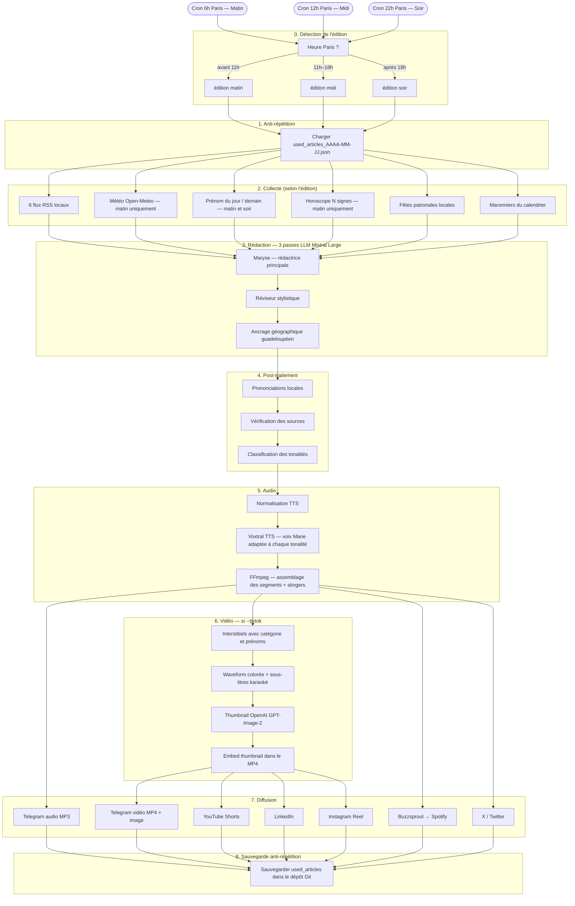

# Flash Info Karukera

> Bulletin audio quotidien de l'actualité guadeloupéenne + horoscope créole, lu par Maryse Condé, généré automatiquement quatre fois par jour et diffusé sur Telegram, Spotify, X/Twitter, YouTube, LinkedIn et Instagram.

---

## Sommaire

1. [À quoi ça sert ?](#à-quoi-ça-sert-)
2. [Comment ça fonctionne en un coup d'œil ?](#comment-ça-fonctionne-en-un-coup-dœil-)
3. [Les trois éditions quotidiennes](#les-trois-éditions-quotidiennes)
4. [La voix de Maryse Condé](#la-voix-de-maryse-condé)
5. [Ce qu'il faut installer sur votre ordinateur](#ce-quil-faut-installer-sur-votre-ordinateur)
6. [Les comptes à créer en ligne](#les-comptes-à-créer-en-ligne)
7. [Installation pas à pas](#installation-pas-à-pas)
8. [Configuration — le fichier de clés API (.env)](#configuration--le-fichier-de-clés-api-env)
9. [Les dossiers nécessaires](#les-dossiers-nécessaires)
10. [Lancer le script à la main — toutes les options](#lancer-le-script-à-la-main--toutes-les-options)
11. [Automatisation — GitHub Actions (le pilote automatique)](#automatisation--github-actions-le-pilote-automatique)
12. [Ce qui se passe chaque jour automatiquement](#ce-qui-se-passe-chaque-jour-automatiquement)
13. [Configurer les comptes tiers étape par étape](#configurer-les-comptes-tiers-étape-par-étape)
14. [Personnaliser le flash info](#personnaliser-le-flash-info)
15. [Structure complète du projet](#structure-complète-du-projet)
16. [Pipeline technique détaillé](#pipeline-technique-détaillé)
17. [Questions fréquentes](#questions-fréquentes)

---

## À quoi ça sert ?

**Flash Info Karukera** est un programme informatique qui crée automatiquement un bulletin d'informations audio sur l'actualité de la Guadeloupe — comme une émission de radio, mais fabriquée par un ordinateur.

Chaque jour, **trois fois par jour**, le programme :

1. Va chercher les dernières nouvelles guadeloupéennes sur les sites d'information locaux
2. Écrit un texte radio dans le style de la voix guadeloupéenne de **Maryse Condé**
3. Transforme ce texte en voix humaine (synthèse vocale)
4. Crée optionnellement une vidéo avec les paroles qui défilent (comme des karaoké)
5. Envoie tout automatiquement sur **Telegram**, **Spotify**, **X (anciennement Twitter)**, **YouTube**, **LinkedIn** et **Instagram**

**Karukera**, c'est le nom amérindien de la Guadeloupe — "l'île aux belles eaux".

---

## Comment ça fonctionne en un coup d'œil ?

```
Chaque matin, midi et soir :

  Sites d'info locaux (RSS)          Météo de Pointe-à-Pitre
         │                                     │
         └──────────────┬──────────────────────┘
                        │
                   Maryse rédige
                   (intelligence artificielle Mistral)
                        │
                   Révision du style
                        │
                   Ancrage guadeloupéen
                        │
                   Lecture à voix haute
                   (synthèse vocale Voxtral)
                        │
              ┌─────────┴──────────┐
              │                    │
           Audio MP3           Vidéo MP4
              │                    │
    ┌─────────┴──────┐    ┌────────┴──────────┐
    │                │    │                   │
 Telegram       Spotify  YouTube          LinkedIn
 Buzzsprout     X/Twitter                Instagram
```

---

## Les trois éditions quotidiennes

Le programme publie **trois flash infos par jour**, chacun avec un contenu adapté à l'heure :

| Édition | Heure (Guadeloupe) | Heure (Paris) | Contenu |
|---------|-------------------|---------------|---------|
| **Horoscope** | 1h du matin | 5h–6h | Horoscope 7 signes · 5 rubriques · vidéo TikTok · Buzzsprout |
| **Matin** | 2h du matin | 6h | Intro du matin · Actualités (24h) · Météo · Prénom du jour |
| **Midi** | 7h du matin | 12h | Intro du midi · Actualités (8h) |
| **Soir** | 15h | 20h | Intro du soir · Actualités (8h) · Prénom de demain |

> La Guadeloupe a **4 heures de retard** sur Paris en hiver, **5 heures** en été.

### Ce qui change entre les éditions

- **L'intro et l'outro** de Maryse sont différentes pour chaque moment de la journée
- **La météo** n'est lue que le matin
- **Les prénoms** : le matin on souhaite la fête aux prénoms du jour, le soir on annonce les prénoms de *demain*
- **L'horoscope** n'est lu que le matin
- **Les maronniers** (événements récurrents du calendrier guadeloupéen) peuvent apparaître selon le jour

### Comment le programme sait quelle édition jouer ?

Il regarde l'heure de Paris au moment où il démarre :
- Avant 11h → édition **matin**
- Entre 11h et 18h → édition **midi**
- Après 18h → édition **soir**

Vous pouvez aussi lui indiquer manuellement : `--edition matin` (voir la section options).

### Anti-répétition entre les éditions

Pour éviter de répéter les mêmes nouvelles trois fois dans la même journée, le programme garde en mémoire les articles déjà utilisés dans un fichier :

```
data/used_articles_2026-04-24.json
```

Ce fichier est mis à jour automatiquement après chaque édition. Chaque édition choisit des articles *différents* des éditions précédentes de la même journée.

---

## La voix de Maryse Condé

**Maryse Condé** (1934–2024) était une romancière guadeloupéenne, lauréate du prix Nobel alternatif de littérature en 2018. Elle a écrit *Ségou*, *Moi, Tituba, sorcière...*, *La Migration des cœurs*.

Le flash info est rédigé et lu par une **intelligence artificielle** qui incarne sa voix : directe, chaleureuse, ancrée dans le quotidien guadeloupéen, sans langue de bois. Elle parle de Karukera pour les Guadeloupéens et la diaspora.

Sa personnalité est définie dans le fichier `prompts/maryse_ame.md`. Vous pouvez lire ce fichier pour comprendre qui elle est. Si vous modifiez ce fichier, vous changez la "personnalité" de la voix.

---

## Ce qu'il faut installer sur votre ordinateur

Avant de commencer, il faut installer trois logiciels gratuits sur votre ordinateur.

### Python (le moteur du programme)

Python est le langage de programmation utilisé par le script. Il faut la version **3.12 ou plus récente**.

**Sur Windows :**
1. Aller sur [python.org/downloads](https://www.python.org/downloads/)
2. Cliquer sur le gros bouton jaune "Download Python 3.12.x"
3. Lancer l'installateur téléchargé
4. **Important :** cocher la case "Add Python to PATH" avant de cliquer sur Install
5. Vérifier que ça marche : ouvrir l'invite de commandes (`Windows + R`, taper `cmd`, Entrée) et taper :
   ```
   python --version
   ```
   Vous devez voir s'afficher `Python 3.12.x` ou plus.

**Sur Mac :**
1. Aller sur [python.org/downloads](https://www.python.org/downloads/)
2. Télécharger et installer la version pour Mac
3. Ou, si vous avez Homebrew : `brew install python@3.12`

**Sur Linux :**
```bash
sudo apt install python3.12 python3.12-venv python3-pip
```

### FFmpeg (pour créer les vidéos et assembler l'audio)

FFmpeg est un logiciel gratuit qui manipule les fichiers audio et vidéo. Il est **indispensable** même si vous ne faites pas de vidéos.

**Sur Windows :**
1. Aller sur [ffmpeg.org/download.html](https://ffmpeg.org/download.html)
2. Cliquer sur le logo Windows → télécharger la version "essentials"
3. Extraire l'archive dans `C:\ffmpeg\`
4. Ajouter `C:\ffmpeg\bin` à votre variable d'environnement PATH
   (Panneau de configuration → Système → Variables d'environnement → PATH → Modifier → Nouveau → coller le chemin)
5. Vérifier : dans l'invite de commandes, taper `ffmpeg -version`

**Sur Mac :**
```bash
brew install ffmpeg
```

**Sur Linux :**
```bash
sudo apt install ffmpeg fonts-noto-color-emoji
```
> La commande `fonts-noto-color-emoji` installe les polices emoji, nécessaires pour les vidéos.

### Git (pour télécharger le projet et le mettre à jour)

Git est un outil qui permet de télécharger des projets depuis GitHub et de les tenir à jour.

**Sur Windows :** Aller sur [git-scm.com](https://git-scm.com/), télécharger et installer.

**Sur Mac :** `brew install git` ou il est souvent déjà installé.

**Sur Linux :** `sudo apt install git`

---

## Les comptes à créer en ligne

Le programme a besoin d'accéder à plusieurs services en ligne. Pour chaque service, vous devez créer un compte et obtenir une **clé API** — c'est comme un mot de passe spécial qui permet au programme d'utiliser le service.

### Services obligatoires

| Service | À quoi ça sert | Coût |
|---------|----------------|------|
| [Mistral AI](https://console.mistral.ai/) | Rédige le texte radio (intelligence artificielle) + fait la synthèse vocale | Payant selon utilisation |
| [Telegram](https://telegram.org/) | Envoie les messages audio et vidéo | Gratuit |
| [Buzzsprout](https://www.buzzsprout.com/) | Héberge le podcast → disponible sur Spotify | Gratuit avec limites |
| [X / Twitter](https://developer.x.com/) | Publie un tweet | Gratuit (accès basique) |

### Services optionnels

| Service | À quoi ça sert | Coût |
|---------|----------------|------|
| [OpenAI](https://platform.openai.com/) | Génère l'image de couverture (thumbnail) | Payant selon utilisation |
| [YouTube](https://console.cloud.google.com/) | Publie les vidéos courtes sur YouTube Shorts | Gratuit |
| [LinkedIn](https://www.linkedin.com/developers/) | Publie la vidéo sur votre profil LinkedIn | Gratuit |
| [Meta for Developers](https://developers.facebook.com/) | Publie en Reel sur Instagram | Gratuit (compte Business requis) |

---

## Installation pas à pas

### Étape 1 — Télécharger le projet

Ouvrez l'invite de commandes (Windows) ou le terminal (Mac/Linux), puis tapez :

```bash
git clone https://github.com/famibelle/FlashInfoKarukera.git
cd FlashInfoKarukera
```

Cela crée un dossier `FlashInfoKarukera` sur votre ordinateur avec tous les fichiers du projet.

### Étape 2 — Créer un espace Python isolé (recommandé)

Cela évite que les bibliothèques du projet n'interfèrent avec le reste de votre ordinateur.

```bash
python -m venv .venv
```

Puis **activer** cet espace :

```bash
# Sur Windows :
.venv\Scripts\activate

# Sur Mac ou Linux :
source .venv/bin/activate
```

Vous verrez `(.venv)` apparaître au début de la ligne de commande — c'est normal, ça veut dire que l'espace est activé.

> **À chaque nouvelle session :** il faudra ré-activer l'environnement avec la même commande `activate` avant de lancer le script.

### Étape 3 — Installer les bibliothèques Python

```bash
pip install -r requirements.txt
```

Cette commande lit le fichier `requirements.txt` et installe automatiquement tout ce dont le programme a besoin.

### Étape 4 — Créer le fichier de configuration `.env`

C'est dans ce fichier que vous allez mettre toutes vos clés API (voir section suivante).

```bash
# Sur Windows :
copy NUL .env

# Sur Mac ou Linux :
touch .env
```

Puis ouvrez ce fichier avec un éditeur de texte simple (Bloc-notes sur Windows, TextEdit sur Mac) et remplissez-le avec vos clés.

### Étape 5 — Créer les dossiers nécessaires

```bash
mkdir Stingers
mkdir Media
```

- **Stingers/** : c'est là que vous mettez vos fichiers audio de jingle (les petites musiques entre les segments). Si le dossier est vide, un jingle simple est généré automatiquement.
- **Media/** : c'est là que vous mettez les images utilisées dans les vidéos et les thumbnails.

---

## Configuration — le fichier de clés API (.env)

Le fichier `.env` contient toutes vos clés d'accès aux services en ligne. **Ce fichier est privé** — il ne doit jamais être partagé, ni envoyé sur GitHub (le programme l'ignore automatiquement grâce au fichier `.gitignore`).

Voici le contenu complet du fichier `.env` à remplir :

### Clés obligatoires

```env
# ─────────────────────────────────────────────────
# Mistral AI — cerveau du flash info (rédaction + voix)
# Obtenir sur : https://console.mistral.ai/
# ─────────────────────────────────────────────────
MISTRAL_API_KEY=votre-clé-mistral-ici

# ─────────────────────────────────────────────────
# Telegram — envoi des messages
# Voir section "Configurer les comptes tiers" pour créer le bot
# ─────────────────────────────────────────────────
TELEGRAM_BOT_TOKEN=123456789:ABCdef-votre-token-ici
TELEGRAM_CHAT_ID=-1001234567890

# ─────────────────────────────────────────────────
# Buzzsprout — hébergement du podcast (→ Spotify)
# Obtenir sur : buzzsprout.com → Account → API Access
# ─────────────────────────────────────────────────
BUZZSPROUT_API_TOKEN=votre-token-buzzsprout
BUZZSPROUT_PODCAST_ID=votre-id-podcast

# ─────────────────────────────────────────────────
# X / Twitter — publication du tweet
# Obtenir sur : developer.x.com
# ─────────────────────────────────────────────────
X_API_KEY=votre-api-key
X_API_SECRET=votre-api-secret
X_ACCESS_TOKEN=votre-access-token
X_ACCESS_TOKEN_SECRET=votre-access-token-secret
```

### Clé optionnelle — Image de couverture (OpenAI)

Uniquement si vous voulez que le programme génère automatiquement une illustration pour le thumbnail :

```env
# OpenAI GPT-Image — génération du thumbnail illustré
# Obtenir sur : platform.openai.com
OPENAI_API_KEY=sk-votre-clé-openai
```

### Clés optionnelles — YouTube Shorts

```env
# YouTube — publication des vidéos courtes
# Obtenir sur : console.cloud.google.com (voir section configuration)
YOUTUBE_CLIENT_ID=votre-client-id.apps.googleusercontent.com
YOUTUBE_CLIENT_SECRET=votre-client-secret
YOUTUBE_REFRESH_TOKEN=                    # rempli automatiquement après la 1ère connexion
```

### Clés optionnelles — LinkedIn

```env
# LinkedIn — publication vidéo sur votre profil
# Obtenir sur : linkedin.com/developers
LINKEDIN_CLIENT_ID=votre-client-id
LINKEDIN_CLIENT_SECRET=votre-client-secret
LINKEDIN_ACCESS_TOKEN=votre-access-token   # valide 60 jours, renouvelé automatiquement
LINKEDIN_REFRESH_TOKEN=votre-refresh-token # valide 1 an, renouvelé automatiquement
LINKEDIN_PERSON_ID=votre-identifiant-linkedin
```

> **Comment trouver votre `LINKEDIN_PERSON_ID` ?** Connectez-vous sur LinkedIn, allez sur votre profil, regardez l'URL dans votre navigateur. La partie après `/in/` est votre identifiant. Exemple : `https://www.linkedin.com/in/marie-dupont-123abc/` → `marie-dupont-123abc`.

### Clés optionnelles — Instagram

```env
# Instagram — publication en Reel
# Nécessite un compte Business ou Créateur lié à une Page Facebook
INSTAGRAM_ACCESS_TOKEN=votre-token         # valide 60 jours, renouvelé automatiquement
INSTAGRAM_USER_ID=123456789                # ID numérique de votre compte
```

---

## Les dossiers nécessaires

### `Stingers/` — Les jingles musicaux

Ce dossier contient les petites musiques (jingles) insérées entre chaque segment du flash info. Formats acceptés : `.mp3` ou `.wav`.

```
Stingers/
├── jingle_principal.mp3
└── transition.wav
```

- Si vous mettez plusieurs fichiers, le programme en choisit un au hasard pour chaque transition
- Si le dossier est **vide**, un bip sonore simple est généré automatiquement — le flash fonctionne quand même

### `Media/` — Les images

Ce dossier contient les images utilisées dans les vidéos et comme miniatures (thumbnails).

```
Media/
├── botiran_profile.jpg                    # portrait de référence pour GPT-Image (obligatoire si --tiktok)
├── botiran_news_default_thumbnail.png     # image de secours si la génération automatique échoue
├── botiran_news_banner.png                # bannière affichée dans les interstitiels vidéo
└── autres_images.png
```

> Si vous ne faites pas de vidéos (`--tiktok` non activé), ce dossier peut être vide.

### `prompts/` — Les instructions pour l'IA

Ce dossier contient les fichiers texte qui expliquent à l'intelligence artificielle comment écrire et parler. Vous pouvez les lire et les modifier pour changer le style du flash info.

```
prompts/
├── maryse_ame.md    # L'âme de Maryse Condé — qui elle est, son histoire, sa voix
├── maryse.md        # Comment Maryse rédige le flash info — structure, ton, registre
├── styliste.md      # Un réviseur qui vérifie le style oral, supprime le lyrisme excessif
├── ancrage.md       # Un correcteur qui ancre le texte dans la géographie guadeloupéenne
├── tones.md         # Règles pour classer le ton de chaque segment (neutre, joyeux, triste...)
├── prenom.md        # Comment Maryse souhaite la fête aux prénoms du jour
└── horoscope.md     # Comment Maryse lit l'horoscope (avec le respect dû aux ancêtres)
```

### `data/` — Les données et la mémoire

```
data/
├── sources.py                    # La liste des sites d'info locaux consultés
├── tts_normalize.py              # Prononciations locales (ex. : "Lyannaj" → "Lyan naje")
├── fetes_patronales.py           # Les fêtes patronales des communes guadeloupéennes
├── marroniers.py                 # Événements récurrents du calendrier (rentrée, Noël, etc.)
├── geography.py                  # Lieux et géographie de la Guadeloupe
├── weather_codes.py              # Codes météo → texte lisible ("01" → "ciel dégagé")
├── rss.xml                       # Cache des dernières actualités téléchargées
└── used_articles_YYYY-MM-DD.json # Mémoire anti-répétition du jour (créé automatiquement)
```

#### À propos du fichier `used_articles_YYYY-MM-DD.json`

Ce fichier est **créé automatiquement** par le programme. Vous n'avez pas à le toucher.

Il contient la liste des titres d'articles déjà utilisés dans la journée. Ainsi, si le flash du matin a parlé d'un article sur la grève des bus, le flash du midi ne le répétera pas.

Un nouveau fichier est créé chaque jour (la date fait partie du nom). Les vieux fichiers peuvent être supprimés au bout de quelques jours.

---

## Lancer le script à la main — toutes les options

Pour lancer le programme, ouvrez l'invite de commandes dans le dossier du projet et tapez :

```bash
python flash-info-gwada.py [OPTIONS]
```

### Options de base

| Option | Ce que ça fait | Exemple |
|--------|----------------|---------|
| *(aucune option)* | Lance le flash complet du jour et publie partout | `python flash-info-gwada.py` |
| `--date AAAA-MM-JJ` | Rejouer un flash pour une date précise dans le passé | `--date 2026-04-17` |
| `--edition` | Choisir l'édition (matin / midi / soir). Si absent, détecté automatiquement selon l'heure | `--edition soir` |
| `--dry-run` | Mode test : génère l'audio et l'envoie sur Telegram, mais **sans** publier sur Buzzsprout ni X | `--dry-run` |
| `--no-send` | Génère uniquement le fichier MP3, sans l'envoyer nulle part | `--no-send` |
| `--output CHEMIN` | Choisir où sauvegarder le fichier MP3 | `--output /tmp/test.mp3` |
| `--stinger FICHIER` | Utiliser un jingle précis (le fichier doit être dans `Stingers/`) | `--stinger mon_jingle.mp3` |
| `--verbose` | Affiche beaucoup de détails pendant l'exécution (utile pour comprendre ce qui se passe) | `--verbose` |

### Options vidéo

| Option | Ce que ça fait | Exemple |
|--------|----------------|---------|
| `--tiktok` | Génère une vidéo verticale (1080×1920 pixels) pour chaque segment, avec la forme d'onde de l'audio et les paroles qui défilent | `--tiktok` |
| `--youtube` | Publie les vidéos sur **YouTube Shorts** (nécessite `--tiktok` et les clés YouTube dans `.env`) | `--tiktok --youtube` |
| `--linkedin` | Publie la vidéo complète sur **LinkedIn** (nécessite `--tiktok`) | `--tiktok --linkedin` |
| `--instagram` | Publie la vidéo complète en **Reel Instagram** (nécessite `--tiktok` et un compte Business) | `--tiktok --instagram` |

### Options thumbnail (image de couverture)

| Option | Ce que ça fait | Exemple |
|--------|----------------|---------|
| `--thumbnail FICHIER` | Utiliser votre propre image comme thumbnail au lieu de la génération automatique | `--thumbnail Media/mon_image.png` |
| `--no-thumbnail` | Désactiver complètement le thumbnail (pas de génération, pas d'image de couverture) | `--no-thumbnail` |
| `--generate-thumbnail` | Générer **uniquement** le thumbnail sans lancer tout le flash (pour tester l'image) | `--generate-thumbnail` |

### Options horoscope (dans flash-info-gwada.py)

| Option | Ce que ça fait | Exemple |
|--------|----------------|---------|
| `--horoscope-signs N` | Nombre de signes astrologiques dans la rubrique (défaut : 3) | `--horoscope-signs 3` |
| `--horoscope-include SIGNE` | Forcer un ou plusieurs signes (français ou anglais). Si spécifié, le signe du jour n'est plus ajouté automatiquement | `--horoscope-include verseau --horoscope-include lion` |

---

## Horoscope Karukera — script dédié

Le script `horoscope-gwada.py` génère un horoscope complet indépendant du flash info, avec une intro et une outro dédiées, chaque signe structuré en 5 rubriques dans la voix de Maryse, et une vidéo TikTok.

### Pipeline

```
fetch_horoscope (API) → Mistral Large (intro) → TTS
                      → Mistral Large × N signes → TTS × N
                      → Mistral Large (outro) → TTS
                      → FFmpeg assemblage audio
                      → Vidéo TikTok (si --tiktok) → compression auto → Telegram
                      → Buzzsprout
```

### Les 5 rubriques de chaque signe

Chaque signe est structuré en 5 mouvements dans la voix de Maryse, sans balises visibles dans l'audio mais clairement annoncés :

1. **Amour** — vie intime, image créole incarnée
2. **Travail** — vie professionnelle et projets
3. **Argent** — finances, dépenses, opportunités du jour
4. **Amitiés** — famille, amis, collectif
5. **Prévisions** — ce que les astres annoncent pour les jours qui viennent

### Options de horoscope-gwada.py

```bash
python horoscope-gwada.py [OPTIONS]
```

| Option | Ce que ça fait | Exemple |
|--------|----------------|---------|
| `--horoscope-signs N` | Nombre de signes (défaut : 7) | `--horoscope-signs 3` |
| `--horoscope-include SIGNE` | Forcer un signe précis. Sans cette option, le signe du jour est inclus automatiquement | `--horoscope-include libra` |
| `--tiktok` | Génère et envoie la vidéo TikTok sur Telegram | `--tiktok` |
| `--telegram` | Envoie l'audio MP3 sur Telegram (indépendamment de `--tiktok`) | `--telegram` |
| `--no-send` | Génère sans publier sur Buzzsprout | `--no-send` |
| `--date AAAA-MM-JJ` | Générer l'horoscope pour une date précise | `--date 2026-04-27` |
| `--stinger FICHIER` | Jingle entre les signes | `--stinger jingle.mp3` |
| `--verbose` | Affiche le texte généré par Maryse pour chaque signe | `--verbose` |

### Anti-répétition flore/faune

Le script mémorise les éléments de la palette créole (plantes, animaux, lieux) utilisés dans chaque signe et les interdit aux signes suivants. La mémoire persiste 7 jours dans `data/used_flora.json` — commité automatiquement par GitHub Actions.

### Compression vidéo automatique

Si la vidéo générée dépasse 49 Mo (limite Telegram), elle est automatiquement recompressée via FFmpeg avant l'envoi, avec un bitrate calculé dynamiquement selon la durée.

**Liste complète des signes acceptés** (en français ou en anglais) :

| Français | Anglais | Dates |
|----------|---------|-------|
| belier / bélier | aries | 21 mars – 19 avril |
| taureau | taurus | 20 avril – 20 mai |
| gemeaux / gémeaux | gemini | 21 mai – 20 juin |
| cancer | cancer | 21 juin – 22 juillet |
| lion | leo | 23 juillet – 22 août |
| vierge | virgo | 23 août – 22 septembre |
| balance | libra | 23 septembre – 22 octobre |
| scorpion | scorpio | 23 octobre – 21 novembre |
| sagittaire | sagittarius | 22 novembre – 21 décembre |
| capricorne | capricorn | 22 décembre – 19 janvier |
| verseau | aquarius | 20 janvier – 18 février |
| poissons | pisces | 19 février – 20 mars |

### Options de diagnostic (pour tester sans tout lancer)

| Option | Ce que ça fait |
|--------|----------------|
| `--check-feeds` | Vérifie que tous les sites d'info sont accessibles et affiche un rapport. Ne génère pas d'audio. |
| `--transcript` | Après avoir généré l'audio, le transcrit à nouveau en texte pour vérifier la prononciation. Sauvegarde un fichier `.txt` à côté du MP3. |
| `--test-prenom [DATE]` | Affiche le(s) prénom(s) du jour depuis nominis.cef.fr sans lancer le flash. Accepte une date optionnelle au format `AAAA-MM-JJ`. |
| `--test-interstitials DOSSIER` | Recrée uniquement les vidéos interstitielles (écrans de titre) à partir d'une session précédente. Évite de tout régénérer. |

### Exemples concrets

```bash
# Flash du matin complet avec vidéo et publication partout
python flash-info-gwada.py --edition matin --tiktok --youtube --linkedin --instagram

# Test rapide sans rien publier (juste pour voir le résultat)
python flash-info-gwada.py --dry-run --verbose

# Flash du soir avec vidéo mais sans thumbnail
python flash-info-gwada.py --edition soir --tiktok --no-thumbnail

# Rejouer un ancien flash du 15 avril
python flash-info-gwada.py --date 2026-04-15 --tiktok

# Vérifier le prénom du jour pour la fête du 15 août
python flash-info-gwada.py --test-prenom 2026-08-15

# Horoscope avec 4 signes, dont le verseau en obligatoire
python flash-info-gwada.py --horoscope-signs 4 --horoscope-include verseau

# Vérifier que les sites d'info sont accessibles
python flash-info-gwada.py --check-feeds
```

---

## Automatisation — GitHub Actions (le pilote automatique)

**GitHub Actions** est un service gratuit de GitHub qui permet de lancer des programmes automatiquement, sans que vous ayez à faire quoi que ce soit.

Concrètement : vous configurez une fois les secrets (voir ci-dessous), et GitHub se charge de lancer le flash info trois fois par jour, tous les jours, même si votre ordinateur est éteint.

### Comment activer le pilote automatique

1. Le projet doit être hébergé sur **GitHub** (pas juste sur votre ordinateur)
2. Aller sur la page de votre projet GitHub → onglet **Settings** (Paramètres)
3. Dans le menu de gauche, cliquer sur **Secrets and variables** → **Actions**
4. Cliquer sur **New repository secret** pour chaque clé à ajouter

### Les secrets à configurer sur GitHub

Ces secrets sont les mêmes clés que dans votre fichier `.env` — mais au lieu d'être dans un fichier sur votre ordinateur, elles sont stockées de façon sécurisée sur GitHub.

**Obligatoires :**
```
MISTRAL_API_KEY
TELEGRAM_BOT_TOKEN
TELEGRAM_CHAT_ID
BUZZSPROUT_API_TOKEN
BUZZSPROUT_PODCAST_ID
X_API_KEY
X_API_SECRET
X_ACCESS_TOKEN
X_ACCESS_TOKEN_SECRET
```

**Optionnel — Thumbnail OpenAI :**
```
OPENAI_API_KEY
```

**Optionnels — YouTube :**
```
YOUTUBE_CLIENT_ID
YOUTUBE_CLIENT_SECRET
YOUTUBE_REFRESH_TOKEN
```

**Optionnels — LinkedIn :**
```
LINKEDIN_CLIENT_ID
LINKEDIN_CLIENT_SECRET
LINKEDIN_ACCESS_TOKEN
LINKEDIN_REFRESH_TOKEN
LINKEDIN_PERSON_ID
```

**Optionnels — Instagram :**
```
INSTAGRAM_ACCESS_TOKEN
INSTAGRAM_USER_ID
```

> **Important pour LinkedIn et Instagram :** leurs tokens expirent après 60 jours. Le programme les renouvelle automatiquement *sur votre ordinateur*, mais sur GitHub il faut mettre à jour les secrets manuellement quand ils expirent. Pensez à noter la date d'expiration.

### Lancer le flash manuellement depuis GitHub

Vous pouvez déclencher un flash à la demande depuis le site GitHub :

1. Aller sur la page de votre projet → onglet **Actions**
2. Dans la liste de gauche, cliquer sur **Flash Info Guadeloupe**
3. Cliquer sur le bouton **Run workflow** (à droite)
4. Un formulaire apparaît avec plusieurs options :

| Paramètre | Description | Valeur par défaut |
|-----------|-------------|-------------------|
| `date` | Date au format AAAA-MM-JJ (laisser vide = aujourd'hui) | *(vide = aujourd'hui)* |
| `edition` | matin / midi / soir (laisser vide = auto selon l'heure) | *(vide = auto)* |
| `dry_run` | Mode test (Telegram seulement, pas Buzzsprout/X) | false |
| `tiktok` | Générer les vidéos TikTok/YouTube Shorts | true |
| `youtube` | Publier sur YouTube | false |
| `linkedin` | Publier sur LinkedIn | false |
| `instagram` | Publier en Reel Instagram | false |
| `no_thumbnail` | Désactiver le thumbnail | false |
| `horoscope_signs` | Nombre de signes horoscope | 2 |
| `verbose` | Afficher les détails d'exécution dans les logs | false |

5. Cliquer sur **Run workflow** → le flash démarre dans la minute

---

## Ce qui se passe chaque jour automatiquement

Voici le déroulement complet d'une journée type :

### 6h00 (Paris) — Édition du matin

1. GitHub lance le programme automatiquement
2. Le programme récupère les **actualités de la nuit** depuis les sites d'info locaux
3. Il récupère la **météo** de Pointe-à-Pitre
4. Il récupère le **prénom du jour** depuis nominis.cef.fr
5. Il récupère l'**horoscope** de 2 signes choisis au hasard
6. Il vérifie s'il y a des **fêtes patronales** dans les communes
7. Il vérifie les **maronniers** du calendrier guadeloupéen
8. Maryse **rédige** le flash en 3 passes (rédaction → révision → ancrage local)
9. Le texte est **lu à voix haute** (synthèse vocale)
10. Les vidéos sont **générées** (si activé)
11. L'image de couverture est **créée** (si OpenAI configuré)
12. Tout est **envoyé** sur Telegram, Spotify, X, YouTube...
13. La liste des articles utilisés est **sauvegardée** dans `data/used_articles_2026-04-24.json`

### 12h00 (Paris) — Édition du midi

Même processus, mais :
- Pas de météo, pas de prénoms, pas d'horoscope
- Les articles déjà publiés le matin sont **exclus automatiquement**
- Maryse fait une intro spécifique pour le midi
- La liste des articles utilisés est **mise à jour**

### 22h00 (Paris) — Édition du soir

Même processus, mais :
- Pas de météo, pas d'horoscope
- Les **prénoms de demain** sont annoncés (pas ceux d'aujourd'hui)
- Les articles déjà publiés matin et midi sont **exclus automatiquement**
- Maryse fait une intro spécifique pour le soir

---

## Configurer les comptes tiers étape par étape

### Telegram — Créer un bot

Un "bot" Telegram est un compte automatisé qui peut envoyer des messages dans un canal ou un groupe.

1. Ouvrir Telegram et chercher **@BotFather** (le compte officiel de création de bots)
2. Envoyer la commande `/newbot`
3. BotFather vous demande un **nom** pour votre bot (ex. : "Flash Info Karukera")
4. Puis un **nom d'utilisateur** qui doit finir par `bot` (ex. : `flash_karukera_bot`)
5. BotFather vous envoie un **token** qui ressemble à `123456789:ABCdef...` → c'est votre `TELEGRAM_BOT_TOKEN`

Pour trouver votre `TELEGRAM_CHAT_ID` :
1. Créer un canal ou un groupe Telegram
2. Ajouter votre bot comme **administrateur** de ce canal
3. Envoyer un message dans le canal
4. Aller sur `https://api.telegram.org/bot<VOTRE_TOKEN>/getUpdates` dans votre navigateur
5. Chercher la valeur `"chat":{"id":...}` dans la réponse → c'est votre `TELEGRAM_CHAT_ID`
   (Pour les canaux, l'ID commence par `-100`)

### Buzzsprout — Trouver vos clés

1. Se connecter sur [buzzsprout.com](https://www.buzzsprout.com/)
2. Aller dans **Account** (votre compte) → **API Access**
3. Copier votre **API Token**
4. Votre **Podcast ID** est visible dans l'URL de votre podcast : `buzzsprout.com/123456/` → `123456`

### X / Twitter — Créer une application

1. Aller sur [developer.x.com](https://developer.x.com/)
2. Créer un compte développeur (si pas encore fait) — X peut demander à valider votre usage
3. Dans le tableau de bord, créer une **New App**
4. Donner un nom à votre app
5. Dans les **Settings** de l'app, activer les permissions **Read and Write**
6. Dans **Keys and Tokens**, générer et copier les 4 clés :
   - `API Key` → `X_API_KEY`
   - `API Key Secret` → `X_API_SECRET`
   - `Access Token` → `X_ACCESS_TOKEN`
   - `Access Token Secret` → `X_ACCESS_TOKEN_SECRET`

### YouTube — Configurer l'API Google

1. Aller sur [console.cloud.google.com](https://console.cloud.google.com/)
2. Créer un **nouveau projet** (bouton en haut à gauche, à côté du logo Google Cloud)
3. Dans la barre de recherche, chercher **YouTube Data API v3** et **l'activer**
4. Aller dans **APIs & Services** → **Credentials** (Identifiants)
5. Cliquer sur **Create Credentials** → **OAuth client ID**
6. Choisir **Desktop application** comme type
7. Télécharger le fichier JSON et copier `client_id` et `client_secret` dans `.env`
8. **Première connexion :** lancer `python flash-info-gwada.py --tiktok --youtube`
   - Une fenêtre de navigateur s'ouvre pour vous connecter à votre compte Google et autoriser l'accès
   - Le `YOUTUBE_REFRESH_TOKEN` est sauvegardé automatiquement dans `.env`
   - Les fois suivantes, plus besoin de se reconnecter

### LinkedIn — Configurer l'API

1. Aller sur [linkedin.com/developers](https://www.linkedin.com/developers/)
2. Cliquer sur **Create app**
3. Remplir le nom, lier à votre profil, accepter les conditions
4. Dans l'onglet **Products**, activer **Share on LinkedIn** et **Video Upload API**
5. Dans l'onglet **Auth**, copier `Client ID` et `Client Secret` dans `.env`
6. Générer les tokens OAuth avec les scopes `w_member_social` et `video.upload`
   (processus technique — chercher un tutoriel "LinkedIn OAuth 2.0 Python" si besoin)
7. Le script renouvelle automatiquement les tokens à chaque exécution

### Instagram — Configurer l'API Meta

> Instagram n'est **pas disponible pour les comptes personnels**. Il faut obligatoirement un compte **Business** ou **Créateur** lié à une **Page Facebook**.

1. Aller sur [developers.facebook.com](https://developers.facebook.com/)
2. Créer une **New App** → choisir le type "Business"
3. Dans **Add a product**, choisir **Instagram Graph API**
4. Activer les permissions `instagram_content_publish` et `instagram_basic`
5. Dans le **Graph API Explorer**, générer un token utilisateur avec ces permissions
6. Échanger ce token court contre un token long (valide 60 jours) :
   ```
   https://graph.facebook.com/v21.0/oauth/access_token?grant_type=fb_exchange_token
     &client_id=VOTRE_APP_ID
     &client_secret=VOTRE_APP_SECRET
     &fb_exchange_token=VOTRE_TOKEN_COURT
   ```
7. Récupérer votre `INSTAGRAM_USER_ID` :
   ```
   https://graph.facebook.com/v21.0/me?fields=id&access_token=VOTRE_TOKEN
   ```
8. Copier les deux valeurs dans `.env`
9. Le script renouvelle automatiquement le token avant chaque publication

---

## Personnaliser le flash info

### Ajouter un site d'information

Pour ajouter un nouveau flux RSS (source d'actualité) à surveiller :

1. Ouvrir le fichier `data/sources.py`
2. Trouver la liste `RSS_FEEDS` et ajouter l'URL du flux :

```python
RSS_FEEDS = [
    "https://www.franceantilles.fr/...",
    # Ajouter ici :
    "https://mon-nouveau-site.fr/rss",
]
```

3. Si vous voulez un nom lisible pour ce site, l'ajouter aussi dans `RSS_SOURCES` :

```python
RSS_SOURCES = {
    "mon-nouveau-site.fr": "Mon nouveau site",
}
```

### Corriger une prononciation

Le programme convertit automatiquement certains mots pour que la synthèse vocale les prononce correctement. Par exemple, "Lyannaj" est automatiquement converti en "Lyan naje".

Pour ajouter une correction :

1. Ouvrir `data/tts_normalize.py`
2. Trouver le dictionnaire `PRONONCIATIONS_LOCALES` et ajouter :

```python
PRONONCIATIONS_LOCALES = {
    "Lyannaj": "Lyan naje",
    "Cap-Excellence": "Cap Excèlans",
    # Ajouter ici :
    "NouvelleExpression": "Nouvelle expression telle qu'elle doit être lue",
}
```

### Ajouter une fête patronale

1. Ouvrir `data/fetes_patronales.py`
2. Trouver le dictionnaire `COMMUNES_FETES_PATRONALES`
3. Ajouter la commune avec sa date au format `"MM-JJ"` :

```python
COMMUNES_FETES_PATRONALES = {
    "09-15": ["Nouvelle-Commune"],
    # ...
}
```

### Modifier le style de Maryse

Pour changer la façon dont Maryse rédige le flash :

- **Son identité profonde** → modifier `prompts/maryse_ame.md`
- **La structure du flash** → modifier `prompts/maryse.md`
- **Le style oral** → modifier `prompts/styliste.md`
- **L'ancrage guadeloupéen** → modifier `prompts/ancrage.md`
- **Les prénoms** → modifier `prompts/prenom.md`
- **L'horoscope** → modifier `prompts/horoscope.md`

Ces fichiers contiennent du texte en français. Vous pouvez les lire et les modifier comme n'importe quel document Word — mais ne supprimez pas les mots entre `{accolades}` car ce sont des variables remplies automatiquement.

### Ajouter un maronnier

Les "maronniers" sont des événements récurrents du calendrier qui reviennent chaque année : rentrée scolaire, fêtes de fin d'année, anniversaire de l'abolition de l'esclavage, etc.

Pour en ajouter un, ouvrir `data/marroniers.py` et suivre les exemples existants.

---

## Structure complète du projet

```
FlashInfoKarukera/
│
├── flash-info-gwada.py           # ★ Script principal — flash info (3 éditions/jour)
├── horoscope-gwada.py            # ★ Script horoscope — pipeline dédié (1 fois/jour)
├── requirements.txt              # Liste des bibliothèques Python nécessaires
├── .env                          # Vos clés API (privé, non envoyé sur GitHub)
├── .gitignore                    # Liste des fichiers à ne pas envoyer sur GitHub
│
├── Stingers/                     # Jingles audio entre les segments
│   └── *.mp3 / *.wav
│
├── Media/                        # Images pour thumbnails et interstitiels vidéo
│   ├── botiran_profile.jpg
│   ├── botiran_news_default_thumbnail.png
│   ├── botiran_news_banner.png
│   └── ...
│
├── prompts/                      # Instructions pour l'IA (modifiables)
│   ├── maryse_ame.md             # L'âme de Maryse Condé — son identité, son histoire
│   ├── maryse.md                 # Comment Maryse rédige le flash
│   ├── styliste.md               # Révision du style oral
│   ├── ancrage.md                # Ancrage géographique guadeloupéen
│   ├── tones.md                  # Classification des tonalités
│   ├── prenom.md                 # Souhaiter la fête aux prénoms du jour
│   └── horoscope.md              # Lire l'horoscope avec la conscience des ancêtres
│
├── data/
│   ├── sources.py                # Flux RSS locaux et noms des sources
│   ├── tts_normalize.py          # Prononciations, sigles, conversions pour le TTS
│   ├── fetes_patronales.py       # Fêtes patronales des communes (date → [communes])
│   ├── marroniers.py             # Événements récurrents du calendrier guadeloupéen
│   ├── geography.py              # Lieux et géographie
│   ├── weather_codes.py          # Codes météo WMO → texte lisible
│   ├── rss.xml                   # Cache des actualités (mis à jour automatiquement)
│   ├── used_articles_AAAA-MM-JJ.json  # Anti-répétition articles du jour (créé automatiquement)
│   └── used_flora.json           # Anti-répétition flore/faune horoscope — fenêtre 7 jours
│
├── tests/                        # Tests automatisés
│
└── .github/
    └── workflows/
        ├── flash-info.yml        # Pilote automatique flash info (3×/jour)
        └── horoscope-daily.yml   # Pilote automatique horoscope (1×/jour à 5h UTC)
```

---

## Pipeline technique détaillé



### Les tonalités de voix

Le programme choisit automatiquement la façon dont Maryse lira chaque segment selon son contenu :

| Tonalité | Quand l'utiliser |
|----------|-----------------|
| `neutral` | Information factuelle, météo, administratif |
| `happy` | Introduction, conclusion, bonne nouvelle |
| `excited` | Sport, exploit, événement culturel festif |
| `sad` | Drame, accident, décès |
| `angry` | Grève, conflit, polémique, injustice |
| `curious` | Insolite, découverte, enquête |

---

## Questions fréquentes

### Le script s'arrête avec une erreur "API key not found"

Vérifiez que votre fichier `.env` existe bien à la racine du projet et que la clé concernée est bien remplie. Les clés ne doivent pas avoir de guillemets ni d'espaces autour du `=`.

**Correct :**
```env
MISTRAL_API_KEY=sk-abc123
```

**Incorrect :**
```env
MISTRAL_API_KEY = "sk-abc123"
```

### Le flash du midi répète les mêmes nouvelles que le matin

Le fichier `data/used_articles_AAAA-MM-JJ.json` est vide ou n'a pas été mis à jour après le flash du matin. Si vous lancez le script sur votre ordinateur (pas via GitHub Actions), assurez-vous de ne pas avoir supprimé ce fichier entre les deux lancements.

### L'horoscope ne s'affiche pas

L'horoscope n'est inclus que dans l'**édition du matin**. Si vous lancez une autre édition, l'horoscope est absent par conception.

### Les vidéos sont générées mais le texte dépasse les bords de l'écran

C'est un problème connu avec les catégories très longues. Le programme a été calibré pour la plupart des cas, mais si vous ajoutez une catégorie avec un nom très long dans `data/marroniers.py` ou `data/sources.py`, ajustez la longueur du texte.

### Comment rejouer un flash d'un jour passé ?

```bash
python flash-info-gwada.py --date 2026-04-15 --edition matin --dry-run
```

L'option `--dry-run` envoie seulement sur Telegram (pas sur Buzzsprout ni X), ce qui est conseillé pour les tests.

### Comment tester uniquement le prénom sans tout lancer ?

```bash
# Prénom du jour (aujourd'hui)
python flash-info-gwada.py --test-prenom

# Prénom d'une date précise
python flash-info-gwada.py --test-prenom 2026-08-15
```

### GitHub Actions ne se lance pas aux bonnes heures

Les crons GitHub Actions sont en **UTC** (temps universel). La Guadeloupe a -4h par rapport à UTC en été et -4h en hiver (pas de changement d'heure). Paris a +2h en été et +1h en hiver.

Le fichier `.github/workflows/flash-info.yml` configure :
- `0 5 * * *` → 5h UTC = 6h Paris hiver = 5h Paris été
- `0 11 * * *` → 11h UTC = 12h Paris hiver = 11h Paris été
- `0 21 * * *` → 21h UTC = 22h Paris hiver = 21h Paris été

Le programme détecte automatiquement l'édition (matin/midi/soir) selon l'heure de Paris au moment de l'exécution.

### Le token LinkedIn ou Instagram a expiré

- **LinkedIn access token** : valide 60 jours. Renouvelé automatiquement si vous lancez le script localement. Sur GitHub Actions, il faut mettre à jour le secret `LINKEDIN_ACCESS_TOKEN` manuellement.
- **LinkedIn refresh token** : valide 1 an.
- **Instagram** : token valide 60 jours, renouvelé automatiquement à chaque exécution.

Pour régénérer un token LinkedIn, relancer le flow OAuth sur [linkedin.com/developers](https://www.linkedin.com/developers/) et mettre à jour les secrets GitHub.
